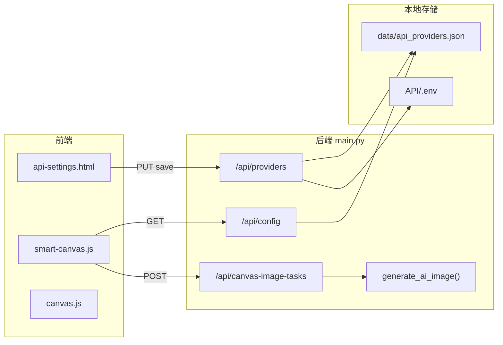
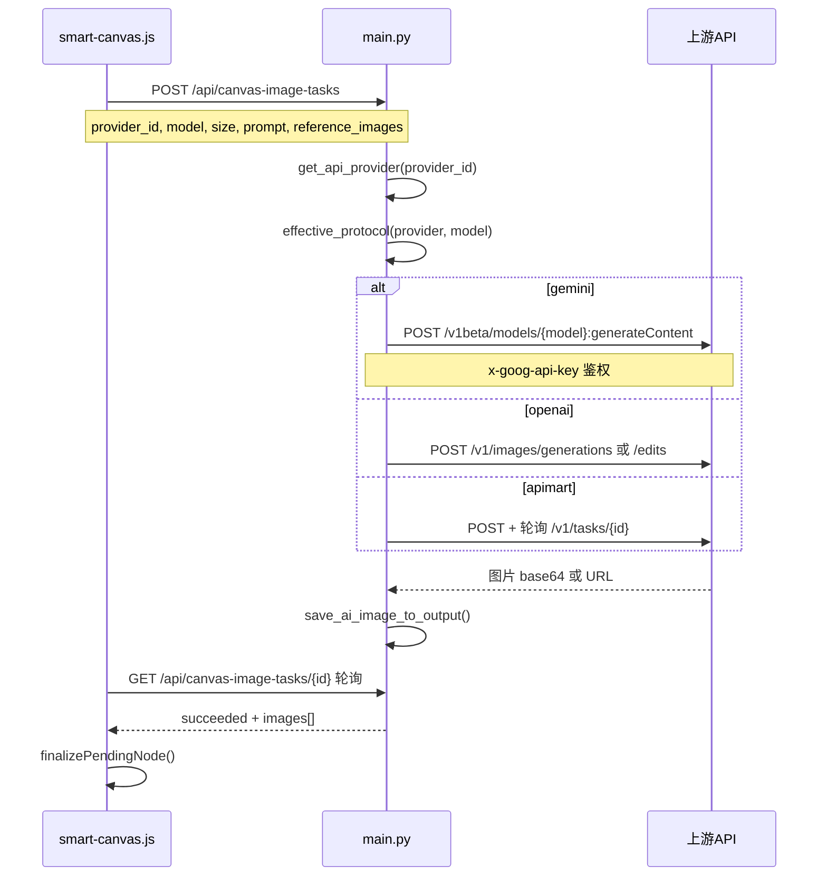

# API 平台接入与画布选型

本文档说明本项目中**第三方 API 平台**从「API 设置页配置」到「画布内选择平台/模型并生图」的完整实现，涵盖 7 种接入路径、前后端数据流，以及 LingkeAI（Nano Banana Pro / `gemini-3-pro-image-preview`）的两种接入对照。

相关文档：

- [图片与视频生成](视频生成.md) — 生图主流程、加载态、结果落盘
- [视频生成参数配置区](视频生成参数配置区.md) — 智能画布 Composer 参数区 UI
- [新手运行与使用教程](../新手运行与使用教程.md) §五 — API 平台配置步骤

---

## 一、结论速览

**是的，核心就是在「API 设置」里配平台、粘贴 API Key 并保存**——但不是单一全局 Key，而是**多平台 Provider 架构**：

1. 打开 `static/api-settings.html`（左下角「API 设置」）
2. 新增或编辑一个平台（如 LingkeAI）
3. 填写 **Base URL**（如 `https://api.lk888.ai`）、**协议**、**API Key**
4. 拉取或手动添加模型（如 `gemini-3-pro-image-preview`）
5. 保存 → Key 写入 `API/.env`，平台配置写入 `data/api_providers.json`
6. 在智能画布 / 普通画布选 **引擎 = API** → 选 **平台** → 选 **模型** → 运行

LingkeAI 文档里的模型 `gemini-3-pro-image-preview` **项目已认识**（内置灵境平台预填同名模型），但 **`api.lk888.ai` 尚未内置**，需手动添加自定义平台。

---

## 二、架构总览



要点：

- **配置与密钥分离**：`data/api_providers.json` 存平台元数据（不含 Key）；`API/.env` 存各平台 Key
- **前端不直连上游**：画布只调本地 `/api/canvas-image-tasks`，由后端代发上游 API
- **保存后热更新**：API 设置保存后通过 `BroadcastChannel('studio-api')` 通知画布刷新，无需重启服务

---

## 三、Provider 数据模型

### 3.1 核心字段

定义于 `main.py` 的 `ApiProviderPayload`（请求体）与 `normalize_provider()`（落盘规范化）：

```2471:2498:main.py
class ApiProviderPayload(BaseModel):
    id: str = ""
    name: str = ""
    base_url: str = ""
    protocol: str = "openai"
    image_request_mode: str = "openai"
    image_generation_endpoint: str = ""
    image_edit_endpoint: str = ""
    enabled: bool = True
    primary: bool = False
    image_models: List[str] = []
    chat_models: List[str] = []
    video_models: List[str] = []
    model_protocols: Dict[str, str] = {}
    ...
    api_key: Optional[str] = None
    clear_key: bool = False
```

| 字段 | 作用 |
|------|------|
| `id` / `name` | 平台标识（`^[a-zA-Z0-9_-]{2,40}$`）与显示名 |
| `base_url` | 上游 API 根地址（即梦 `jimeng` 强制为空） |
| `protocol` | 全局协议，见 §四 |
| `model_protocols` | 单模型协议覆盖，如 `{"gemini-3-pro-image-preview": "gemini"}` |
| `image_models` / `chat_models` / `video_models` | 各能力模型列表 |
| `enabled` / `primary` | 是否启用 / 是否首选（最多一个 primary） |
| `image_request_mode` | OpenAI 子模式：`openai` 或 `openai-json`（Agnes 等） |
| `image_generation_endpoint` / `image_edit_endpoint` | 可选端点覆盖 |
| `rh_apps` / `rh_workflows` | RunningHub AI 应用 / 工作流配置 |
| `ms_loras` | ModelScope LoRA 列表 |
| `volcengine_project_name` / `volcengine_region` | 火山素材库配置 |

保存请求中的 `api_key` **不落盘 JSON**，只写入 `API/.env`。

### 3.2 存储位置

| 用途 | 路径 |
|------|------|
| Provider 配置（无 Key） | `data/api_providers.json` |
| API Keys / 环境变量 | `API/.env` |
| RunningHub 静态默认 | `static/runninghub/api_providers.json` |
| RunningHub 工作流覆盖 | `data/runninghub_workflows.json` |

读写函数：

- `load_api_providers()` → `normalize_provider()` + `merge_default_api_providers()`
- `save_api_providers(providers)` — 写 `data/api_providers.json`
- `update_env_values(updates)` — 合并写 `API/.env`，并 `os.environ[key] = value`
- `PUT /api/providers`（`save_providers()`）— 先 `save_api_providers()`，再 `update_env_values()` + `reload_env_globals()`

### 3.3 Key 环境变量映射

`provider_key_env()`（`main.py`）：

| provider_id | 环境变量 |
|-------------|----------|
| `comfly` | `COMFLY_API_KEY` |
| `modelscope` | `MODELSCOPE_API_KEY` |
| `runninghub` | `RUNNINGHUB_API_KEY` |
| `volcengine` | `ARK_API_KEY` |
| 其他自定义 | `API_PROVIDER_{ID}_KEY`（大写、非字母数字变 `_`） |
| RunningHub 钱包 | `RUNNINGHUB_WALLET_API_KEY` |
| 火山素材库 | `VOLCENGINE_ACCESS_KEY_ID` / `VOLCENGINE_SECRET_ACCESS_KEY` |

保存 `comfly` 时还会同步：`COMFLY_BASE_URL`、`IMAGE_MODELS`、`CHAT_MODELS`、`VIDEO_MODELS`。

### 3.4 协议解析

- `provider_protocol(provider)` — 读平台全局 `protocol`
- `effective_protocol(provider, model)` — 固定平台（modelscope / volcengine / jimeng / runninghub）忽略 `model_protocols`；其他平台可按模型覆盖为 `openai` 或 `gemini`

```3795:3806:main.py
def effective_protocol(provider, model=""):
    """返回某模型实际生效的协议：优先单模型覆盖，否则用平台全局协议。"""
    base = provider_protocol(provider)
    ...
    overrides = (provider or {}).get("model_protocols")
    if isinstance(overrides, dict):
        val = str(overrides.get(str(model or "").strip()) or "").strip().lower()
        if val in PER_MODEL_PROTOCOL_OPTIONS:
            return val
    return base
```

---

## 四、全部接入方式对照表（7 种路径）

`SUPPORTED_PROVIDER_PROTOCOLS`（`main.py:266`）：

```text
openai · apimart · gemini · volcengine · runninghub · jimeng
```

ModelScope 虽协议字段为 `openai`，但按 `provider["id"] == "modelscope"` 独立分发。

**统一图片生成入口**：`generate_ai_image()`（`main.py:8628`），由 `build_online_image_result()` → `run_canvas_image_task()` 调用。

| 接入方式 | 配置入口 | 协议/引擎 | 后端入口函数 | 画布选型字段 |
|---------|---------|----------|-------------|-------------|
| **OpenAI 兼容**（GPT-Image 等） | API 设置，protocol=openai | openai | `generate_ai_image()` OpenAI 分支 | `engine=api`, `provider_id`, `model` |
| **Gemini 生图**（Nano Banana 类） | API 设置，模型协议=gemini | gemini | `generate_gemini_provider_image()` | 同上 |
| **APIMart 异步** | protocol=apimart | apimart | `generate_ai_image()` + `wait_for_image_task()` | 同上 |
| **火山方舟** | 内置 volcengine 平台 | volcengine | `generate_volcengine_provider_image()` | `engine=volcengine` 或 `provider_id=volcengine` |
| **ModelScope** | 内置 modelscope + Token | 独立引擎 | `generate_modelscope_provider_image()` / `/generate` | `engine=modelscope`, `msgenModel` |
| **RunningHub** | 内置 runninghub + 工作流 | runninghub | `generate_runninghub_provider_image()` | `engine=runninghub`, `rhConfigKey` |
| **即梦 CLI** | 添加 jimeng 平台 | jimeng | `generate_jimeng_provider_image()` | `provider_id=jimeng` |

### 4.1 OpenAI 兼容

**最小配置**：

- Base URL：`https://api.example.com`（或带 `/v1` 后缀均可，后端自动补全）
- 协议：OpenAI
- 图片模型：如 `gpt-image-2`

**上游端点**：

- 文生图：`POST {base}/v1/images/generations`
- 图生图：`POST {base}/v1/images/edits`（multipart），失败可回退 JSON generations
- 鉴权：`Authorization: Bearer $API_KEY`

### 4.2 Gemini 生图（Nano Banana / gemini-3-pro-image-preview）

**最小配置**：

- Base URL：`https://api.lk888.ai`（LingkeAI）或 `https://apistudio.vip`（灵境）
- 全局协议：openai（默认）+ **模型行协议选 Gemini**
- 图片模型：`gemini-3-pro-image-preview`
- `model_protocols`：`{"gemini-3-pro-image-preview": "gemini"}`

**上游端点**：

```7481:7527:main.py
def gemini_endpoint_url(provider, model):
    model_name = urllib.parse.quote(gemini_model_name(model), safe="")
    return provider_endpoint_url(provider, "image_generation_endpoint", f"/v1beta/models/{model_name}:generateContent")
...
async def generate_gemini_provider_image(prompt, size, model, reference_images=None, provider=None):
    ...
    body = {
        "contents": [{"role": "user", "parts": parts}],
        "generationConfig": {
            "responseModalities": ["TEXT", "IMAGE"],
            "imageConfig": gemini_image_config(size),
        },
    }
```

- 鉴权：`x-goog-api-key: $API_KEY`（与 LingkeAI 文档兼容）
- 画布 `ratio` / `resolution` 经 `gemini_image_config()` 映射为 `aspectRatio` + `imageSize`（1K/2K/4K）

### 4.3 APIMart 异步

**最小配置**：

- Base URL：`https://api.apimart.ai`
- 协议：APIMart 异步
- 图片模型：按平台拉取

**上游端点**：

- 提交：`POST {base}/v1/images/generations`（JSON，含 `size` + `resolution`）
- 轮询：`GET {base}/v1/tasks/{task_id}`（`wait_for_image_task()`，`main.py:4651`）

### 4.4 火山方舟

**最小配置**：

- 内置平台 `volcengine`，Base URL 默认 `https://ark.cn-beijing.volces.com/api/v3`
- 协议：volcengine（强制）
- Key：`ARK_API_KEY`

**上游端点**：`POST {base}/api/v3/images/generations`

智能画布选 **引擎 = 火山引擎** 时自动绑定 `provider_id = volcengine`。

### 4.5 ModelScope

**最小配置**：

- 内置平台 `modelscope`
- Token：`MODELSCOPE_API_KEY`（API 设置页填写）
- 引擎选 **ModelScope**，不走 `provider_id`

**上游端点**：

- 图片：`POST {api-inference.modelscope.cn}/v1/images/generations` + 异步轮询 `/tasks/{id}`
- 智能画布独立路径：`runModelscopeGeneration()` → `/generate`、`/api/ms/generate` 等

### 4.6 RunningHub

**最小配置**：

- 内置平台 `runninghub`
- Key：`RUNNINGHUB_API_KEY`（可选钱包 Key）
- 引擎选 **RunningHub**，通过 `rhConfigKey` 选择 AI 应用或工作流

**上游端点**：OpenAPI 任务提交 + 轮询；有 app/workflow 配置时走 `generate_runninghub_entry_image()`。

### 4.7 即梦 CLI

**最小配置**：

- 添加 `protocol=jimeng` 平台（本地 CLI，无 base_url）
- `provider_id=jimeng`

**特点**：本地 `text2image` / `image2image`；云端排队时任务状态为 `jimeng_pending`，前端单独轮询。

---

## 五、API 设置页实现

文件：`static/js/api-settings.js` + `static/api-settings.html`

### 5.1 用户操作 → 函数 → 后端 API

| 用户操作 | 关键函数 | 后端 API |
|---------|---------|---------|
| 加载平台列表 | `loadProviders()` | `GET /api/providers` |
| 新增自定义平台 | `addProvider()` | — |
| 一键添加推荐 API | `saveRecommendedApi()` + `RECOMMENDED_APIS` | `PUT /api/providers` |
| 粘贴 Key 并保存 | `saveKeyOnly()` → `saveProviders()` | `PUT /api/providers`（Key 写 `.env`） |
| 验证连接 | `testConnection()` | `POST /api/providers/test-connection` |
| 验证异步协议 | `probeAsync()` | `POST /api/providers/probe-async` |
| 拉取模型 | `fetchModels()` | `POST /api/providers/fetch-models` |
| 单模型设 Gemini 协议 | `updateModelProtocol()` → `model_protocols` | 随 `PUT` 保存 |
| 变更广播 | `broadcastStudioApiChange()` | `BroadcastChannel('studio-api')` |

### 5.2 新增自定义平台

```3068:3078:static/js/api-settings.js
function addProvider(){
    ...
    providers.push({id, name:'API', base_url:'', protocol:'openai', image_request_mode:'openai', ...});
    selectedId = id;
    renderEditor();
}
```

新增后需手动改 `id`（如 `lingkeai`）、`name`、`base_url`，添加模型，粘贴 Key，点保存。

### 5.3 推荐 API 模板（RECOMMENDED_APIS）

`RECOMMENDED_APIS`（`api-settings.js:108`）定义一键添加时的预填内容。灵境 API 是 Nano Banana 同类模型的参考实现：

```108:128:static/js/api-settings.js
const RECOMMENDED_APIS = [
    {
        id:'lingjing',
        name:'灵境API',
        base_url:LINGJING_DEFAULT_BASE_URL,
        protocol:'openai',
        ...
        image_models:['gpt-image-2', 'gemini-3.1-flash-image-preview', 'gemini-3-pro-image-preview'],
        chat_models:['gpt-5.5'],
        video_models:['veo3.1-fast'],
        model_protocols:{'gemini-3.1-flash-image-preview':'gemini', 'gemini-3-pro-image-preview':'gemini'}
    },
    ...
];
```

`saveRecommendedApi()` 流程：创建 provider 条目 → 填入 Key → 设置 protocol → `saveProviders()`。

**若要做 LingkeAI 推荐位**：在 `RECOMMENDED_APIS` 追加类似条目，`base_url: 'https://api.lk888.ai'`，预填 `gemini-3-pro-image-preview` + `model_protocols`。

### 5.4 逐模型协议 UI

固定平台（modelscope / volcengine / jimeng / runninghub）不显示协议下拉；其他平台在模型行旁可选：

- **默认** — 跟随平台全局协议
- **OpenAI**
- **Gemini**

```2958:2967:static/js/api-settings.js
function modelProtocolSelectHtml(kind, index, model, item){
    ...
    return `<select class="model-protocol-select" ... onchange="updateModelProtocol('${kind}', ${index}, this.value)">
        <option value="">默认</option>
        ...
        ${opt('gemini', 'Gemini')}
    </select>`;
}
```

### 5.5 内置平台（不可删除）

`default_api_providers()`（`main.py:702`）强制保留：

| id | name | protocol | 特点 |
|----|------|----------|------|
| `modelscope` | ModelScope | openai | 内置 image/chat 模型、LoRA |
| `runninghub` | RunningHub | runninghub | 默认 apps/workflows |
| `volcengine` | 火山引擎 | volcengine | 方舟 Base URL + 项目/区域 |
| `lingjing` | 灵境API | openai | 预填 GPT/Gemini 模型 + `model_protocols` |

`isFixedProvider()` 不可删除：`modelscope`、`runninghub`、`volcengine`、`lingjing`。

---

## 六、画布内如何选择平台与模型

### 6.1 智能画布（主路径）

文件：`static/js/smart-canvas.js`

**全局状态 `settings`**（默认值）：

```297:301:static/js/smart-canvas.js
let settings = {
    engine:'api',
    apiKind:'image',
    provider_id:'',
    model:'',
```

**引擎下拉 `#engineSelect`**：`api` / `volcengine` / `modelscope` / `comfy` / `runninghub`

| engine | apiKind | provider 字段 | 模型来源 |
|--------|---------|--------------|---------|
| `api` | `image` | `settings.provider_id` | `imageProviders()` |
| `api` | `video` | `settings.videoProvider` | `videoApiProviders()` |
| `volcengine` | image/video | 强制 `volcengine` | `volcengineProvider()` |
| `modelscope` | — | 不用 provider_id | `settings.msgenModel` |
| `runninghub` | — | `settings.rhConfigKey` | `runningHubAllEntries()` |
| `comfy` | — | ComfyUI 实例 | 工作流 |

**API 图片参数渲染**（`renderApiParams()`）：

```2383:2397:static/js/smart-canvas.js
function renderApiParams(){
    const providers = imageProviders();
    if(!settings.provider_id || !providers.some(p => p.id === settings.provider_id)) settings.provider_id = providers[0]?.id || '';
    const models = filterJimengImageModels(providerImageModels(settings.provider_id));
    ...
    dynamicParams.innerHTML = `
        ${renderProviderControl(providers)}
        ${renderModelControl(models)}
        ${renderSizePickerControl('', true)}
        ...
    `;
}
```

`imageProviders()` 过滤条件：已启用、有 `image_models`、排除 `modelscope` 和 `volcengine`。

**提交生图**（`runApiGeneration()`）：

```13867:13875:static/js/smart-canvas.js
async function runApiGeneration(prompt, refs, runSettings=settings){
    ...
    const payload = {prompt, provider_id:runSettings.provider_id, model:runSettings.model, size:sizeForRun(runSettings), ...};
    const tasks = await Promise.all(... fetch('/api/canvas-image-tasks', {method:'POST', ...}));
    return {taskIds:tasks.map(task => task.task_id).filter(Boolean), ...};
}
```

按 `engine:apiKind` 记忆最近参数（localStorage，`smartSettingsModeKey()`）。

### 6.2 普通画布

文件：`static/js/canvas.js`

- **Generator 节点**字段：`node.apiProvider`、`node.model`
- `resolveImageProviderId()` / `sanitizeImageNodeProviderModel()` 校验合法性
- 提交：`provider_id: resolveImageProviderId(gen.apiProvider)`

```588:608:static/js/canvas.js
function resolveImageProviderId(id){
    const providers = imageApiProviders();
    return providers.find(p => p.id === id)?.id || providers[0]?.id || '';
}
function sanitizeImageNodeProviderModel(node){
    if(!node || node.type !== 'generator') return;
    node.apiProvider = resolveImageProviderId(node.apiProvider || '');
    const models = providerImageModels(node.apiProvider);
    ...
}
```

- **ModelScope 节点**（`type=msgen`）：独立 UI，不走 `provider_id`
- **Video 节点**：`resolveVideoProviderId()` + `providerVideoModels()`

### 6.3 配置热更新

API 设置保存后：

```178:182:static/js/api-settings.js
function broadcastStudioApiChange(type='providers-changed'){
    const message = { type, updated_at:Date.now() };
    try { new BroadcastChannel('studio-api').postMessage(message); } catch(e) {}
    ...
}
```

智能画布监听（`smart-canvas.js:16111`）：

```javascript
if(event.data?.type === 'providers-changed' ...) refreshSmartConfigFromSettings();
```

`refreshSmartConfigFromSettings()` 重新 `fetch('/api/config')` 刷新 `apiProviders`，无需重启。

---

## 七、生图请求全链路



### 7.1 后端任务创建

```11160:11176:main.py
@app.post("/api/canvas-image-tasks")
async def create_canvas_image_task(payload: OnlineImageRequest):
    task_id = f"canvas_img_{uuid.uuid4().hex}"
    ...
    asyncio.create_task(run_canvas_image_task(task_id, payload))
    return {"task_id": task_id, "status": "queued"}
```

`run_canvas_image_task()` → `build_online_image_result()` → `generate_ai_image()` 按协议分发。

### 7.2 协议分发（generate_ai_image）

```8628:8639:main.py
async def generate_ai_image(prompt, size, quality, model, reference_images=None, provider_id="comfly"):
    provider = get_api_provider(provider_id)
    if provider["id"] == "modelscope":
        return await generate_modelscope_provider_image(...)
    if is_jimeng_provider(provider):
        return await generate_jimeng_provider_image(...)
    if is_runninghub_provider(provider):
        return await generate_runninghub_provider_image(...)
    if effective_protocol(provider, model) == "gemini":
        return await generate_gemini_provider_image(...)
    if is_volcengine_provider(provider):
        return await generate_volcengine_provider_image(...)
    ...
```

### 7.3 前端轮询

```14359:14377:static/js/smart-canvas.js
async function pollSmartCanvasTask(taskId){
    ...
    for(let i = 0; i < 900; i++){
        await new Promise(resolve => setTimeout(resolve, 2000));
        const task = await fetch(`/api/canvas-image-tasks/${encodeURIComponent(taskId)}`)...
        if(task.status === 'succeeded') return task.result || {};
        if(task.status === 'failed') throw new Error(task.error || ...);
    }
}
```

成功后 `finalizePendingNode()` / `finalizeSmartPendingTask()` 写入节点 `images[]`。

### 7.4 结果落盘

上游返回的图片经 `save_ai_image_to_output()` 保存到 `output/`，URL 形如 `/output/online_xxx.png`。详见 [视频生成.md](视频生成.md) §二。

---

## 八、LingkeAI（Nano Banana Pro）专项对照

LingkeAI 文档要点：

- **model**：`gemini-3-pro-image-preview`
- **BASE_URL**：`https://api.lk888.ai`
- **鉴权**：`Authorization: Bearer` / `x-api-key` / `x-goog-api-key` / URL `?key=`
- **两种接口**：媒体异步（`/v1/media/generate` + `/v1/media/status`）与 Gemini 同步（`/v1beta/models/...:generateContent`）

### 8.1 路径 A：零代码接入（推荐先试）

| 配置项 | 值 |
|--------|-----|
| 平台 id | `lingkeai`（自定义） |
| 平台名称 | LingkeAI |
| Base URL | `https://api.lk888.ai` |
| 全局协议 | `openai`（默认即可） |
| 图片模型 | `gemini-3-pro-image-preview` |
| 模型协议 | **Gemini**（模型行下拉） |
| API Key | LingkeAI 后台 Key |

**操作步骤**：

1. API 设置 → 新增平台（或从推荐区扩展）
2. 填 Base URL、粘贴 Key
3. 图片模型列表添加 `gemini-3-pro-image-preview`
4. 该模型协议选 **Gemini**
5. 验证协议 → 保存
6. 智能画布：引擎 **API** → 平台 **LingkeAI** → 模型 **gemini-3-pro-image-preview** → 设比例与 1K/2K/4K → 运行

**原理**：项目已有 Gemini 分支，调用：

```text
POST https://api.lk888.ai/v1beta/models/gemini-3-pro-image-preview:generateContent
Header: x-goog-api-key: $API_KEY
Body: contents + generationConfig.imageConfig { aspectRatio, imageSize }
```

与 LingkeAI 官方 Gemini 兼容接口一致。参考图最多 14 张（项目上限 `ONLINE_IMAGE_REFERENCE_MAX`，与文档一致）。

### 8.2 路径 B：媒体异步协议（需开发）

LingkeAI 文档的：

```text
POST /v1/media/generate
GET  /v1/media/status?task_id={task_id}
```

**当前未实现**（全仓库无 `media/generate` 匹配）。

若要做正式接入，参考 APIMart 异步模式（`wait_for_image_task()`，`main.py:4651`）：

#### 后端 `main.py`

1. 新增协议识别（如 `lingke` / `media-async`，或 `is_lingke_provider()` 检测 `lk888.ai`）
2. 实现 `generate_lingke_media_image()`：
   - `POST {base}/v1/media/generate`，body：`{model, prompt, params: {aspectRatio, imageSize, images}}`
   - 轮询 `GET {base}/v1/media/status?task_id=...`，判定 `is_final === true` 且 `state === 'success'`
   - 从 `result_url` 下载图片
3. 在 `generate_ai_image()` 分发链加入分支
4. `fetch_models_from_upstream` / `test-connection` 适配（可用 `GET /v1/models`）

#### 前端 `api-settings.js`

1. `RECOMMENDED_APIS` 增加 LingkeAI 模板
2. `protocolInput` 增加新协议选项（若需要独立协议名）
3. 画布**无需改选型 UI** — 仍用 `provider_id` + `model`

#### 与路径 A 的取舍

| | 路径 A（Gemini 同步） | 路径 B（媒体异步） |
|--|---------------------|-------------------|
| 开发量 | 零代码 | 需后端 + 可选前端推荐位 |
| 超时风险 | 长任务可能 HTTP 超时 | 异步轮询更稳 |
| 参数映射 | `gemini_image_config()` | 需新建 `aspectRatio`/`imageSize`/`images` 映射 |
| 适用场景 | 快速验证、20s~2min 内完成 | 生产环境、网络不稳定 |

### 8.3 与内置「灵境 API」的关系

内置 `lingjing`（`main.py:758`）已预填：

```767:770:main.py
            "image_models": ["gpt-image-2", "gemini-3.1-flash-image-preview", "gemini-3-pro-image-preview"],
            ...
            "model_protocols": {"gemini-3.1-flash-image-preview": "gemini", "gemini-3-pro-image-preview": "gemini"},
```

Base URL 默认 `https://apistudio.vip`。

LingkeAI 是**同一模型、不同上游地址**的典型场景 — 复制灵境配置模式，只改 `base_url` 和 Key 即可。

---

## 九、后端 API 端点速查

| 端点 | 处理器 | 作用 |
|------|--------|------|
| `GET /api/config` | `ai_config()` | 含 `api_providers`、模型列表 |
| `GET /api/providers` | `api_providers()` | 平台列表（公开，无 Key） |
| `PUT /api/providers` | `save_providers()` | 保存平台 + Key |
| `POST /api/providers/fetch-models` | `fetch_upstream_models_from_payload()` | 拉取上游模型 |
| `POST /api/providers/test-connection` | 连接测试 | |
| `POST /api/canvas-image-tasks` | `create_canvas_image_task()` | 画布异步生图 |
| `GET /api/canvas-image-tasks/{id}` | `get_canvas_image_task()` | 轮询任务状态 |
| `POST /api/online-image` | `online_image()` | 在线生图同步版 |

---

## 十、开发检查清单

接入新平台（以 LingkeAI 路径 A 为例）：

- [ ] `data/api_providers.json` 有 LingkeAI 条目且 `enabled: true`
- [ ] `API/.env` 有 `API_PROVIDER_LINGKEAI_KEY=...`（或对应 id 的 Key 变量）
- [ ] `image_models` 含 `gemini-3-pro-image-preview`
- [ ] `model_protocols` 中该模型 = `gemini`（或全局协议 = `gemini`）
- [ ] API 设置「验证协议」通过
- [ ] 智能画布 `imageProviders()` 能列出该平台
- [ ] 试跑 `POST /api/canvas-image-tasks` 成功，图片落盘到 `/output/`

若走路径 B（媒体异步），额外检查：

- [ ] `generate_lingke_media_image()` 正确提交与轮询
- [ ] `state` / `is_final` 判定逻辑与文档一致（不用 `status` 中文字段做业务判断）
- [ ] 失败时 `state === 'failed'` 有友好错误提示
- [ ] 长任务超时配置合理（参考 `APIMART_IMAGE_TASK_TIMEOUT`）

---

## 十一、扩展新平台的最小改动指南

若要为 LingkeAI 或其他平台做「类似灵境」的一键推荐 + 画布可选：

| 层级 | 改动 | 文件 |
|------|------|------|
| 推荐模板 | 追加 `RECOMMENDED_APIS` 条目 | `static/js/api-settings.js` |
| 内置默认（可选） | 追加 `default_api_providers()` 条目 | `main.py` |
| 新协议（仅路径 B） | `SUPPORTED_PROVIDER_PROTOCOLS` + 分发函数 | `main.py` |
| 画布选型 | **通常无需改** — 只要 `image_models` 非空即出现在下拉 | `smart-canvas.js` / `canvas.js` |

画布选型逻辑只认 `apiProviders` 数组中的 `id`、`name`、`image_models`、`enabled`，与上游具体协议无关。
