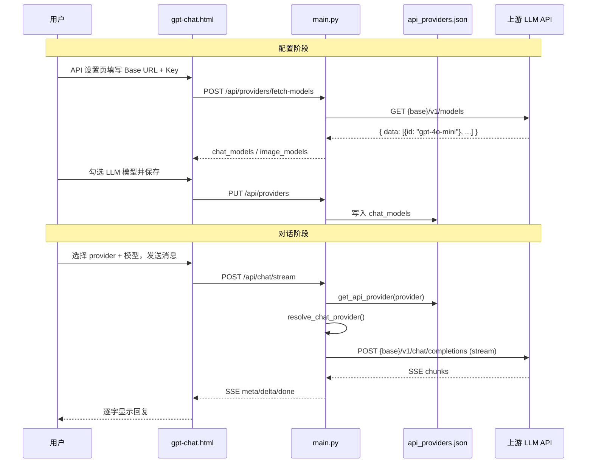

# GPT 对话流程详解

本文档说明 Infinite Canvas 中 **GPT 对话** 功能的完整链路：从侧边栏入口、API 平台配置，到后端转发上游 LLM 接口的底层机制。适合阅读源码或自行开发同类功能时参考。

---

## 1. 整体架构

```
┌─────────────────────────────────────────────────────────────────┐
│  index.html（Studio 壳）                                         │
│  侧边栏 nav-item → switchUI('gpt-chat')                          │
│  iframe 懒加载 → /static/gpt-chat.html                           │
└───────────────────────────┬─────────────────────────────────────┘
                            │ fetch /api/*
                            ▼
┌─────────────────────────────────────────────────────────────────┐
│  main.py（FastAPI 后端）                                         │
│  /api/config          读取平台与模型列表                           │
│  /api/providers       保存 API 平台配置                          │
│  /api/providers/fetch-models  从上游拉取模型                     │
│  /api/chat            非流式对话 / 纯生图                         │
│  /api/chat/stream     流式对话（SSE）                            │
│  /api/chat/agent      Agent 模式（意图路由 + 聊天/生图）          │
│  /api/conversations   对话历史 CRUD                              │
└───────────────────────────┬─────────────────────────────────────┘
                            │ httpx → 上游 OpenAI 兼容 API
                            ▼
┌─────────────────────────────────────────────────────────────────┐
│  第三方 API 平台（Comfly / ModelScope / 自定义 OpenAI 兼容等）    │
│  GET  {base_url}/v1/models          模型列表                     │
│  POST {base_url}/v1/chat/completions  对话补全                  │
└─────────────────────────────────────────────────────────────────┘
```

**核心设计**：前端不直连第三方 API，所有 Key 和 Base URL 保存在服务端；前端只选 `provider` + `model`，由后端 `resolve_chat_provider()` 拼出真实请求地址和鉴权头。

---

## 2. 前端入口与页面结构

### 2.1 从侧边栏进入

| 步骤 | 位置 | 行为 |
|------|------|------|
| 1 | `static/index.html` 侧边栏 | 点击「GPT 对话」→ `switchUI(this, 'gpt-chat')` |
| 2 | iframe 懒加载 | 首次激活时设置 `frame-gpt-chat.src = data-src` |
| 3 | 页面加载 | `gpt-chat.html` 执行 `loadConfig()` + `loadConversations()` |

`switchUI` 还会：
- 记住上次打开的页面（`localStorage`）
- 向 iframe 同步主题和语言
- 通过 `BroadcastChannel('studio-api')` 广播 API 配置变更

### 2.2 gpt-chat.html 本地状态

| 存储键 | 用途 |
|--------|------|
| `gpt_chat_browser_user` | 浏览器级用户 ID，作为 `X-User-ID` 请求头 |
| `gpt_chat_settings_v1` | 模式、provider、模型、系统提示词等 UI 偏好 |
| `gpt_chat_last_conversation_v1` | 上次打开的对话 ID |

启动时调用 `GET /api/config`，合并服务端返回的 `api_providers`、`chat_models`、`ms_chat_models` 等，再与本地设置做校验（`validateSavedProviderState`）。

### 2.3 三种对话模式

| 模式 | 前端 `mode` | 后端接口 | 说明 |
|------|-------------|----------|------|
| **对话** | `chat` | `POST /api/chat/stream` | SSE 流式输出，逐字显示 |
| **Agent** | `agent` | `POST /api/chat/agent` | 先用 LLM 判断意图，再聊天或生图 |
| **生图** | `image` | `POST /api/chat`（`mode=image`） | 直接调用生图 API，不走流式 |

Agent 模式会分别选择：
- **对话模型**（`provider` + `activeChatModel`）— 用于意图路由和普通回复
- **生图模型**（`activeImageProvider` + `activeImageModel`）— 用于 `generate_image` / `edit_image`

---

## 3. API 设置：平台与模型的配置流程

GPT 对话使用的 LLM 来自 **API 设置页**（`static/api-settings.html` + `static/js/api-settings.js`），Owner/Admin 可管理。

### 3.1 配置存储位置

| 数据 | 文件/环境变量 |
|------|---------------|
| 平台列表（id、name、base_url、protocol、chat_models…） | `data/api_providers.json`（多租户时按租户路径） |
| API Key | `API/.env`，键名如 `COMFLY_API_KEY`、`API_PROVIDER_XXX_KEY` |
| ModelScope 聊天模型列表 | 平台配置 + 环境变量 `MODELSCOPE_CHAT_MODELS` |

保存流程：`saveProviders()` → `PUT /api/providers` → `save_api_providers()` + `update_env_values()` → `reload_env_globals()` → 广播 `providers-changed`。

### 3.2 平台（Provider）数据结构

每个平台大致包含：

```json
{
  "id": "comfly",
  "name": "Comfly",
  "base_url": "https://ai.comfly.chat",
  "protocol": "openai",
  "enabled": true,
  "primary": true,
  "chat_models": ["gpt-5.5", "gpt-4o-mini"],
  "image_models": ["gpt-image-2"],
  "video_models": []
}
```

**GPT 对话只使用 `chat_models` 非空的、且 `enabled !== false` 的平台。**

内置保留平台：`modelscope`、`runninghub`、`volcengine`（合并逻辑在 `merge_default_api_providers`）。

### 3.3 配置 API 的操作步骤（可复现）

1. **新增或选中平台** — 填写 `base_url`、选择 `protocol`（默认 `openai`；火山引擎选 `volcengine`）
2. **填写 API Key** — 可单独「保存 Key」或随平台一起保存（火山方舟 Key 写入 `API/.env` 的 `ARK_API_KEY`）
3. **验证地址** — `POST /api/providers/test-connection`  
   后端带着 Key 向 Base URL 的 models 端点发探测请求；401/403 表示 Key 无效，200 + JSON 表示 Key 有效
4. **拉取模型** — `POST /api/providers/fetch-models`  
   同上，从上游模型列表接口获取全部 model id（详见 [§4](#4-为什么填-base-url--api-key-就能识别可用模型)、[§12](#12-api-key-安全说明)）
5. **选择模型** — 在浮层中勾选，按 **生图 / LLM / 视频** 分类导入到 `chat_models` 等字段
6. **保存** — `PUT /api/providers`，GPT 对话页通过 `BroadcastChannel` 自动刷新

### 3.4 前端如何展示可选模型

`gpt-chat.html` 中：

```javascript
function chatProviders() {
  // 从 api_providers 里筛：enabled 且 chat_models 非空
  const list = apiProviders.filter(p => p.enabled !== false && (p.chat_models || []).length);
  // ModelScope 特殊：若 config.ms_chat_models 有值也会注入
  return list;
}
```

用户切换平台 → `setProvider()` → 从该平台的 `chat_models` 里选模型 → 写入 `localStorage` 的 `chatProviderModels[providerId]`，下次自动记忆。

---

## 4. 为什么填 Base URL + API Key 就能识别可用模型？

这是本系统的关键机制：**不是从 URL 字符串本身解析模型名**，而是把 Base URL 当作上游 API 的根地址，去调用标准 **模型列表端点**，由上游返回该 Key 下可用的 model id 列表。

### 4.1 模型列表 URL 的拼装规则

后端 `upstream_models_url(base_url, protocol)` 根据协议追加路径：

| protocol | 请求地址 |
|----------|----------|
| `openai`（默认） | `{base_url}/v1/models` 或 `{base_url}/models`（若已含 `/v1`） |
| `gemini` | `{base_url}/v1beta/models` |
| `volcengine` | `{base_url}/api/v3/models` |
| `runninghub` | RunningHub OpenAPI 专用 models 端点 |

绝大多数 OpenAI 兼容中转站（Comfly、OneAPI、New API 等）都实现 `GET /v1/models`，返回形如：

```json
{
  "data": [
    { "id": "gpt-4o-mini" },
    { "id": "gpt-image-2" }
  ]
}
```

### 4.2 验证与拉取的完整流程

```
用户填写 base_url + api_key
        │
        ▼
POST /api/providers/test-connection  或  fetch-models
        │
        ▼
upstream_models_url() 拼出 GET .../v1/models
        │
        ▼
httpx GET + Authorization: Bearer {api_key}
        │
        ├── 301/302 跳转 → 报错「请填 API Base URL，不要填网页登录地址」
        ├── 响应是 HTML → 报错「不是 API 地址」
        ├── 401/403 → Key 无效
        └── 200 + JSON → parse_upstream_models() 解析 id 列表
                │
                ▼
        classify_upstream_model(id) 按名称关键字分类
                │
                ▼
        返回 { chat_models, image_models, video_models, all }
```

**因此：链接能「识别」模型，需要两个条件同时满足——正确的 API Base URL，以及有效的 API Key。** 系统并不是从 URL 字符串里「猜」模型名，而是带着 Key 去询问上游：「我这个账号能看到哪些模型？」

### 4.2.1 API Key 在其中的作用（通俗版）

可以把 **API Key 理解成上游平台的「账号密码」**：

| 角色 | 类比 |
|------|------|
| **Base URL** | 银行网点的地址（去哪办业务） |
| **API Key** | 你的银行卡 + 密码（证明你是谁、有没有权限） |
| **`GET .../models`** | 问柜台：「我这张卡能办哪些业务？」 |
| **返回的 model id 列表** | 柜台给你的可用业务清单 |

没有 Key，上游不知道你是谁，会返回 `401/403`；Key 错误或过期同样拉不到列表。Key 有效时，上游按 **该 Key 所属账号的权限与开通服务** 返回可见模型——所以你截图里火山引擎显示「找到 124 个模型」，表示这个方舟 API Key 在当前账号下能「看到」124 个模型条目。

**以你配置的火山引擎（方舟）为例**，完整链路是：

```
你在 API 设置页填写
  请求地址：https://ark.cn-beijing.volces.com/api/v3
  API Key：  ARK_API_KEY（方舟控制台创建）
        │
        ▼
点击「验证地址」或「拉取模型」
        │
        ▼
浏览器 → POST /api/providers/test-connection 或 fetch-models
        │   Body 里带上 base_url + api_key
        ▼
Infinite Canvas 后端（main.py）
        │   upstream_models_url() 拼出：
        │   GET https://ark.cn-beijing.volces.com/api/v3/models
        │   Header: Authorization: Bearer {你的 Key}
        ▼
火山引擎方舟服务器
        │   校验 Key → 查账号权限 → 返回 JSON
        ▼
后端 parse_upstream_models() 提取 id
        │   classify_upstream_model() 按名称关键字分到 生图/LLM/视频
        ▼
前端浮层「从上游拉取的模型清单」展示（如 doubao-seedream-4-5-251128）
```

**重要区分：**

- **「识别到模型」** = 上游 models 接口返回了 id 列表（说明 Key 有效、地址正确）。
- **「实际能调用成功」** = 还要看你账号是否开通该模型、余额是否足够、聊天是否需填 `ep-...` 推理接入点等。火山协议提示里说的「模型列表只代表可见模型」，就是这个意思——列表是「目录」，不等于每一项都能直接拿来对话。

### 4.3 自动分类规则（启发式，非上游官方分类）

上游通常只返回 flat 的 model id，后端用 `classify_upstream_model()` 按 **名称关键字** 猜测用途：

| 分类 | 关键字示例 |
|------|------------|
| video | `veo`, `sora`, `wan2`, `kling`, `video`, `t2v-`… |
| image | `dalle`, `flux`, `image`, `midjourney`, `seedream`… |
| chat | 以上都不匹配时默认归为 LLM |

用户在「选择模型」浮层里可手动改分类；最终以保存到 `api_providers.json` 的 `chat_models` 为准。

### 4.4 特殊协议的处理

| 场景 | 行为 |
|------|------|
| **火山方舟** | `/api/v3/models` 可能为空；会 probe 任务接口，自动切 `volcengine` 协议，聊天模型常需手动填 `ep-...` 接入点 |
| **RunningHub** | 走官方 OpenAPI 注册表，非简单 `/v1/models` |
| **即梦 jimeng** | 不拉远程列表，使用内置默认模型表 |
| **Agnes** | 若 base_url 含 `apihub.agnes-ai.com`，注入默认视频模型并检测 `openai-json` 图片模式 |

### 4.5 协议自动探测（test-connection）

对 `openai` 协议还会：
1. 调 `GET /v1/models`
2. 若失败，尝试 `probe_volcengine_auto_detect`（探测方舟任务端点 / OpenAI 兼容 chat 端点）
3. 检测到方舟则返回 `protocol: volcengine`，前端 `applyDetectedProtocol()` 自动切换

---

## 5. 发送消息：API 应用流程

### 5.1 对话模式（chat）— 流式

```
用户输入 → sendMessage()
    │
    ├─ 追加 user bubble（含 reference_images 附件）
    │
    └─ streamChatMessage()
           POST /api/chat/stream
           Body: {
             conversation_id, message, system_prompt,
             mode: "chat",
             provider, model, ms_model,
             reference_images
           }
           Header: X-User-ID
                │
                ▼ 后端
           1. load/new conversation，保存 user message
           2. resolve_chat_provider(provider, model, ms_model)
              → chat_base, headers, resolved_model
           3. 组装 upstream_messages（system + 最近 30 条历史）
           4. POST {chat_base}/chat/completions  stream:true
           5. SSE 推送 meta → delta → done
           6. 流结束后保存 assistant message
                │
                ▼ 前端
           读 ReadableStream，解析 data: {...}
           delta 实时更新 bubble；done 时刷新完整 messages
```

### 5.2 Agent 模式

```
POST /api/chat/agent
    │
    ├─ decide_chat_agent_action()
    │     用对话 LLM 返回 JSON：{ action, prompt, reply }
    │     action ∈ chat | generate_image | edit_image
    │
    ├─ chat → build_chat_text_reply() → /chat/completions
    │
    └─ generate_image / edit_image
          pick_chat_image_provider()
          generate_ai_image() → 保存到 output → 返回 image_url
```

意图路由失败时回退到 `heuristic_agent_decision()`（关键词规则）。

### 5.3 生图模式（image）

```
POST /api/chat  mode=image
    → generate_ai_image()
    → 不走 /chat/completions
```

---

## 6. 后端核心：`resolve_chat_provider`

所有聊天请求的统一入口（`main.py`）：

```python
def resolve_chat_provider(provider, model, ms_model):
    if provider == "modelscope":
        # ModelScope 独立：base = modelscope_api_root(), Key 来自 MODELSCOPE_API_KEY
        ...
    api_provider = get_api_provider(provider)
    base_root = api_provider["base_url"]
    mdl = selected_model(model, preferred_chat_model(api_provider))
    protocol = effective_protocol(api_provider, mdl)
    # 按协议追加路径后缀
    if protocol == "gemini":   base = base_root + "/v1beta"
    elif protocol == "volcengine": base = base_root + "/api/v3"
    elif protocol == "runninghub": base = RUNNINGHUB_LLM_BASE_URL
    else:                      base = base_root + "/v1"  # OpenAI 兼容
    hdrs = api_headers(provider=api_provider, model=mdl)
    return base, hdrs, mdl
```

实际 LLM 调用：

```
POST {base}/chat/completions
Headers: Authorization: Bearer {key}  （Gemini 用 x-goog-api-key）
Body: { "model": "...", "messages": [...], "stream": true/false }
```

`get_api_provider()` 逻辑：
- 按 `provider_id` 查 `load_api_providers()`
- 找不到或未指定 → 回退到 `primary=True` 或第一个非 modelscope 平台
- Key 从 `API/.env` 的 `{PROVIDER}_KEY` 读取

---

## 7. 对话历史与多模态

### 7.1 存储

- 路径：`data/conversations/{user_id}/{conversation_id}.json`
- 用户 ID：前端生成的 UUID，经 `X-User-ID` 传递（`safe_user_id` 校验）
- 接口：`GET/POST/DELETE /api/conversations`

### 7.2 历史消息如何送给上游

- 最多取最近 `MAX_HISTORY_MESSAGES`（默认 30）条
- `upstream_message_from_record()`：
  - 纯文本 → `{ role, content: "..." }`
  - 带附件 → `content` 为数组，含 `text` + `image_url`（Vision 模型）
  - `type=image` 的 assistant 消息跳过（不参与 LLM 上下文）

### 7.3 系统提示词

请求体中的 `system_prompt` 优先；为空则用环境变量 `SYSTEM_PROMPT`。

---

## 8. 配置变更的联动

```
api-settings 保存
    → PUT /api/providers
    → broadcastStudioApiChange('providers-changed')
         ├─ BroadcastChannel('studio-api')
         └─ postMessage 到所有 iframe
    → gpt-chat.html 收到后 loadConfig() 刷新 provider/model 列表
```

画布 LLM 节点、在线生图等页面同样监听该事件。

---

## 9. 自行开发同类功能：建议步骤

### 9.1 最小可用版本（MVP）

1. **数据模型** — `Provider { id, base_url, chat_models }` + `.env` 存 Key
2. **配置 API** — `GET/PUT /api/providers`，`GET /api/config` 给前端
3. **模型发现** — `GET {base}/v1/models` + 解析 `data[].id`
4. **对话 API** — `POST /api/chat/stream`：
   - 读 conversation
   - `resolve` base + key + model
   - 转发 `chat/completions`，SSE 回传
5. **前端页** — provider/model 下拉 + 输入框 + 流式渲染

### 9.2 与本项目对齐的增强项

| 功能 | 参考位置 |
|------|----------|
| 多平台 + primary | `load_api_providers`, `get_primary_provider_id` |
| 协议分支（Gemini/火山/RunningHub） | `upstream_models_url`, `effective_protocol` |
| 模型自动分类 | `classify_upstream_model`, `parse_upstream_models` |
| Agent 意图路由 | `decide_chat_agent_action`, `/api/chat/agent` |
| 多模态附件 | `upstream_message_from_record` |
| 租户隔离 API 配置 | `auth/tenant.py` → `api_providers_path` |

### 9.3 自测清单

- [ ] Base URL 填网页地址 → 应提示 HTML/跳转错误
- [ ] Key 错误 → 401 友好提示
- [ ] 拉取模型 → `chat_models` 出现在 GPT 对话模型选择器
- [ ] 流式对话 → 逐字显示，刷新后历史完整
- [ ] 切换 provider → 模型列表切换，localStorage 记忆
- [ ] 修改 API 设置并保存 → 对话页无需刷新即可更新模型
- [ ] Agent：「画一只猫」→ 走生图；「你好」→ 纯文本

### 9.4 常用调试命令

```bash
# 查看当前配置
curl http://127.0.0.1:3000/api/config

# 测试连接（需替换 base_url 和 key）
curl -X POST http://127.0.0.1:3000/api/providers/test-connection \
  -H "Content-Type: application/json" \
  -d '{"base_url":"https://your-api.example.com","api_key":"sk-xxx","protocol":"openai"}'

# 流式对话
curl -N -X POST http://127.0.0.1:3000/api/chat/stream \
  -H "Content-Type: application/json" \
  -H "X-User-ID: test-user" \
  -d '{"message":"你好","provider":"comfly","model":"gpt-4o-mini","mode":"chat"}'
```

---

## 10. 关键文件索引

| 文件 | 职责 |
|------|------|
| `static/index.html` | Studio 壳、`switchUI`、iframe 管理 |
| `static/gpt-chat.html` | GPT 对话 UI、三种模式、流式渲染 |
| `static/api-settings.html` | API 平台管理 UI |
| `static/js/api-settings.js` | 验证地址、拉取模型、保存 provider |
| `main.py` | 全部后端逻辑（约 13542 行起 GPT 对话路由） |
| `data/api_providers.json` | 平台与模型列表持久化 |
| `API/.env` | API Key 与环境默认值 |
| `data/conversations/` | 按用户 ID 分目录的对话 JSON |

---

## 11. 流程图（端到端）



---

## 12. API Key 安全说明

很多初次配置的人会问：**我把 Key 填进这个系统，安不安全？Key 会不会泄露？** 下面按本项目的实际实现说明。

### 12.1 Key 存在哪里？

| 内容 | 存储位置 | 是否进 Git |
|------|----------|------------|
| API Key（如火山 `ARK_API_KEY`） | 服务端 `API/.env` | **否**（已在 `.gitignore` 排除） |
| 平台地址、已选模型列表 | `data/api_providers.json`（多租户时按租户分文件） | 通常也不提交 |
| 浏览器 localStorage | 仅 UI 偏好（上次选的 provider/model），**不存 Key** | — |

保存 Key 时：`PUT /api/providers` → `update_env_values()` 写入 `API/.env` → `reload_env_globals()` 加载到进程环境变量。`api_providers.json` 里 **只有模型名和 Base URL，没有明文 Key**。

### 12.2 谁能看到 Key？

| 角色 | 能看到什么 |
|------|------------|
| **普通使用 GPT 对话的用户** | 只能选 provider + model，**看不到 Key** |
| **Owner / Admin（API 设置页）** | 可在表单里输入、修改 Key；保存后页面只显示 `••••••••fca4` 这类 **末四位预览**（`mask_secret`） |
| **任意调用 `GET /api/config` 的人** | 收到的是 `has_key: true` + `key_preview`，**不是完整 Key** |
| **能登录服务器的人** | 可直接读 `API/.env` 文件 |

启用登录鉴权（`auth`）后，**只有 Owner 能改 API 平台配置**（`assert_provider_manage`）；普通成员不能用 API 设置页写入 Key。若未启用鉴权（本地单机 `run.bat` 默认场景），同一局域网内能打开 `:3000` 的人理论上都能进 API 设置页——此时应把服务限制在内网或加反向代理鉴权。

### 12.3 Key 在请求里怎么流动？

```
配置阶段（验证 / 拉取模型）：
  浏览器输入 Key → POST 本机 /api/providers/* → 本机后端 → HTTPS → 上游（火山等）

使用阶段（对话 / 生图）：
  浏览器只发 provider + model → 本机后端从 .env 读 Key → HTTPS → 上游
  （前端不直连第三方，Key 不暴露给浏览器里的业务 JS）
```

也就是说：**Key 不会写进前端静态资源，也不会在 `GET /api/config` 里完整返回。** 但你在 API 设置页保存时，Key 会经 **浏览器 → 你的 Infinite Canvas 服务器** 传一次（应使用 HTTPS 部署生产环境）。

### 12.4 这样填 Key，算安全吗？

**相对安全的典型场景（推荐）：**

- 公司 **内网自建** Infinite Canvas，只有管理员能访问 API 设置页
- `API/.env` 权限收紧，不提交 Git、不发到群聊/截图
- 服务器不对公网裸奔 `:3000`，或前面有 Nginx + 登录
- Key 在火山/中转站控制台设置了 **用量上限、IP 白名单**（若平台支持）

**需要警惕的风险：**

| 风险 | 说明 |
|------|------|
| **Key = 计费凭证** | 谁拿到 Key，谁就能用你的账号额度调 API、产生费用 |
| **服务器被入侵** | `API/.env` 明文存储，机器失陷则 Key 失陷 |
| **无鉴权公网暴露** | 若整站挂公网且未开登录，陌生人可能进 API 设置改配置 |
| **管理员误操作** | 把 `.env` 或带 Key 的截图发到外部 |
| **中转站信任** | Key 交给第三方中转平台时，对方也能代你调用上游 |

**结论：** 把 Key 填进 **你自己部署、自己管控的 Infinite Canvas**，和把 Key 填进其他自托管网关（OneAPI、New API 等）风险同级——**Key 必须信任运行后端的那台机器和管理员**。不建议把生产 Key 填到不可控的他人服务器或演示环境。

### 12.5 火山引擎（方舟）Key 的补充说明

- 你在截图里填的是 **方舟 API Key**（环境变量名 `ARK_API_KEY`），在 [火山方舟控制台](https://console.volcengine.com/ark) 创建。
- 验证时会请求 `/api/v3/models`；生图模型如 `doubao-seedream-*` 可直接用列表里的 id，**聊天模型往往要在控制台创建 `ep-...` 推理接入点**，手动填进 `chat_models`，列表里的公开名不一定能直接对话。
- 若还配置了 `VOLCENGINE_ACCESS_KEY_ID` / `VOLCENGINE_SECRET_ACCESS_KEY`，那是另一套 IAM 凭证，同样落在 `API/.env`，规则与方舟 Key 相同。
- 定期在火山控制台 **轮换 Key、查看调用账单**；离职或泄露时立即作废旧 Key 并新建。

### 12.6 安全使用 checklist

- [ ] `API/.env` 已在 `.gitignore`，从未 push 到远程仓库
- [ ] 生产环境启用 Owner 登录，普通用户无 API 设置权限
- [ ] 服务器仅内网或 HTTPS + 访问控制，不对公网开放未鉴权的 3000 端口
- [ ] 上游平台开启余额告警 / 用量限制
- [ ] 不再使用时在 upstream 控制台 **删除或禁用** 该 Key
- [ ] 截图、日志、错误上报中避免包含完整 Key（本系统 UI 已做末四位掩码）

---

## 13. 常见问题

**Q：为什么填了 API Key 就能列出模型？**  
A：后端用你的 Key 调用上游标准的模型列表接口（OpenAI 兼容多为 `GET /v1/models`，火山为 `GET /api/v3/models`）。上游验证 Key 后返回该账号可见的 model id；本系统再按名称关键字自动分成生图/LLM/视频，供你在浮层里勾选。详见 [§4.2](#42-验证与拉取的完整流程) 与 [§4.2.1](#421-api-key-在其中的作用通俗版)。

**Q：我的 API Key 填在这个系统里安全吗？**  
A：Key 只保存在服务端 `API/.env`，不会完整下发给前端；对话时由后端代发请求。安全前提是你信任 **部署 Infinite Canvas 的服务器和管理员**，并做好内网/鉴权/HTTPS。详见 [§12](#12-api-key-安全说明)。

**Q：为什么填了官网首页 URL 拉不到模型？**  
A：需要的是 **API Base URL**（如 `https://api.openai.com` 或中转站提供的 `/v1` 根地址），不是控制台登录页。后端会检测 HTML 响应和 HTTP 跳转并报错。

**Q：模型列表和实际能聊天的不一致？**  
A：`/v1/models` 返回的是「账户可见」列表；部分模型可能仅支持 image 或需额外权限。分类是启发式的，最终以你保存进 `chat_models` 的为准。

**Q：GPT 对话和画布 LLM 节点用的是同一套配置吗？**  
A：是。都读 `GET /api/config` 的 `api_providers`，LLM 节点使用各平台的 `chat_models`。

**Q：ModelScope 为什么单独处理？**  
A：历史原因保留独立入口；`provider=modelscope` 时走 `MODELSCOPE_API_KEY` 和固定 inference 地址，不与其他 OpenAI 兼容平台混用。

---

*文档版本：与代码库 2026-06 同步。核心实现以 `main.py` 为准；API Key 存储见 `update_env_values()`、`public_provider()`、`provider_key_env()`。*
