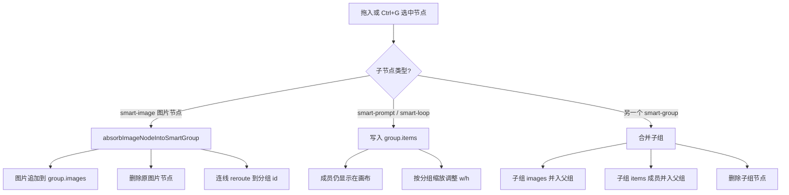

# 无限画布快捷键与操作流程

本文档基于当前仓库源码（`static/js/canvas.js` 普通无限画布、`static/js/smart-canvas.js` 智能画布）整理，描述**已实现**的快捷键与鼠标操作。Mac 用户将 `Ctrl` 换为 `⌘`（Command）即可。

---

## 画布类型说明

| 类型 | 入口 | 主文件 | 特点 |
|------|------|--------|------|
| **普通无限画布** | `canvas.html?id=...` | `canvas.js` | 节点编辑器，手动拖线连接，支持多种生成节点 |
| **智能画布** | `smart-canvas.html?id=...` | `smart-canvas.js` | 卡片式创作，自动连线，底部 Composer 写提示词生成 |

两者快捷键大体相似，但分组、连线、创建方式有差异，下文会分别标注。

---

## 一、创作（节点 / 连线 / 分组）

### 1.1 唤起创建菜单（新建节点）

| 操作 | 普通无限画布 | 智能画布 |
|------|-------------|----------|
| **双击空白处** | ❌ 未绑定（仅右键） | ✅ 打开快捷创建菜单 |
| **右键空白处** | ✅ 打开创建菜单 | ✅ 打开创建菜单 |
| **双击智能分组** | — | ✅ 在分组内打开创建菜单（新建节点自动入组） |
| **右键智能分组** | — | ✅ 同上 |
| **Tab 键** | ❌ 未实现 | ❌ 未实现 |

> **说明**：部分设计稿中的「Tab 唤起节点菜单」在当前原生 JS 版本**尚未落地**。等效操作是：**双击 / 右键空白处**打开创建菜单。

**普通画布创建菜单可建节点**：上传、提示词、循环、LLM、API 生成、ModelScope、视频、RH、ComfyUI、**LTX Director（分镜时间线）**、Output。

**智能画布创建菜单可建**：上传（图片/音视频）、分组、提示词、循环。

### 1.2 从端口拖线新建（智能画布）

在智能画布中，从节点**输入/输出端口**按住左键拖到**空白处**松开：

1. 自动在落点创建一个新的**图片节点**
2. 自动与源节点**建立连线**

这是除创建菜单外最常用的「边连边建」方式。

### 1.3 从连线末端新建（普通画布）

在普通画布中，从节点**输出端口**拖线到空白处松开：

- 若源节点是生成器类型：可直接创建 **Output 节点**并连线
- 其他情况：弹出**关联创建菜单**（生成器、图片、提示词、循环、分组等）

从**输入端口**拖线到空白处：弹出可连接的输入类型菜单。

### 1.4 成组

| 快捷键 | 普通无限画布 | 智能画布 |
|--------|-------------|----------|
| **Ctrl + G** | ✅ 将选中图片/提示词节点合并为 `group` 或空分组 | ✅ 将选中节点合并为**智能分组**（`smart-group`） |

成组、解组、拖入拖出、连线合并、工具栏等完整说明见 **[七、分组功能详细版](#七分组功能详细版)**。

### 1.5 解组 / 解散分组

| 快捷键 | 普通无限画布 | 智能画布 |
|--------|-------------|----------|
| **Ctrl + Shift + G** | ❌ 未实现 | ✅ 释放选中分组 |
| **分组工具栏「解散分组」** | — | ✅ 选中智能分组后点击浮动菜单 |

详见 **[七、分组功能详细版](#七分组功能详细版)**。

### 1.6 合并分镜组

| 快捷键 | 状态 |
|--------|------|
| **Ctrl + Alt + G**（合并分镜组） | ❌ 当前版本**未实现** |

**相关已有能力**：

- 普通画布可创建 **LTX Director** 节点，内置分镜时间线编辑器（片段时间轴、删段、空格播放等）
- 提示词模板库有「**分镜**」分类（`storyboard`），用于快速填入分镜类提示词，与「合并分镜组」快捷键无关

### 1.7 复制

| 快捷键 | 普通无限画布 | 智能画布 |
|--------|-------------|----------|
| **Ctrl + C** | ✅ 复制选中节点及它们之间的连线 | ✅ 同上（toast 提示已复制数量） |
| **Ctrl + V** | ✅ 粘贴到鼠标位置（延迟 90ms，避免与图片粘贴冲突） | ✅ 同上 |
| **Ctrl + D** | ❌ 未实现 | ❌ 未实现 |

**粘贴优先级（智能画布）**：

1. 剪贴板有图片/音视频文件 → 填入选中节点或新建
2. 素材库「复制到画布」收件箱（localStorage）→ 网格平铺粘贴
3. 节点剪贴板 → `pasteNodes()`

**普通画布粘贴**：选中空图片节点时 `Ctrl+V` 可填入图片；多文件时建组图。

### 1.8 拖拽复制

| 操作 | 普通无限画布 | 智能画布 |
|------|-------------|----------|
| **Alt + 拖动节点** | ✅ 复制节点（含 group 子成员）再拖动副本 | ✅ `duplicateForAltDrag`：复制选中节点+内部连线 |
| **Ctrl + Alt + 拖动（独立参数副本）** | ❌ 未实现 | ❌ 未实现 |
| **拖动多图缩略图** | — | ✅ 从多图节点/分组中拖出单张 → 拆成新图片节点 |

**普通画布 Alt 拖逻辑**：原地 clone，选中副本，随后拖动副本；分组会连同子节点一起复制。

**智能画布缩略图拖出**：多图节点（或分组）内按住某张缩略图拖动超过 6px → 该图从源节点剥离并生成新节点。

### 1.9 连线

| 操作 | 普通无限画布 | 智能画布 |
|------|-------------|----------|
| **端口拖线** | ✅ 手动连接 in/out 端口 | ✅ 同上 |
| **Ctrl + L 自动串联** | ❌ 未实现 | ❌ 未实现 |
| **Ctrl + 拖动靠近目标** | — | ✅ 松手自动连线（不移动节点位置） |
| **点击连线中点 ×** | — | ✅ 断开连线（含合并连线） |
| **循环节点拖入连线** | — | ✅ Ctrl 拖动循环节点到连线上 → 插入中间 |

### 1.10 执行生成

| 操作 | 说明 |
|------|------|
| **点击「生成」按钮** | 智能画布 Composer 或节点上的运行按钮 |
| **Ctrl + Enter** | ❌ 当前版本**未实现**全局快捷键 |

### 1.11 框选多选

| 操作 | 普通无限画布 | 智能画布 |
|------|-------------|----------|
| **Ctrl + 空白处拖动** | ✅ 框选 | ✅ 框选 |
| **R + 空白处拖动** | ✅ 框选（按住 R） | ✅ 框选（按住 R） |

框选后拖动任一选中节点，**整组一起移动**（含分组成员）。

### 1.12 删除

| 快捷键 | 说明 |
|--------|------|
| **Delete / Backspace** | 删除选中节点（含分组内子节点一并删除） |

智能画布：若图片节点仅有媒体，第一次 Delete 可能只清空媒体保留空节点（`clearNodeMediaBeforeDelete`）。

---

## 二、缩放（画布视口）

| 操作 | 普通无限画布 | 智能画布 |
|------|-------------|----------|
| **滚轮** | ✅ 以光标为中心缩放（×0.92 / ×1.08） | ✅ 以光标为中心缩放（指数因子） |
| **Z**（无修饰键） | ✅ 切换全局预览 / 退出预览 | ✅ 同上 |
| **Ctrl + + / - / 0** | ❌ 未实现 | ❌ 未实现 |
| **Ctrl + 滚轮** | ❌（直接滚轮缩放） | ❌（直接滚轮缩放） |
| **预览模式内点击节点** | ✅ 缩放到该节点 | ✅ 同上 |
| **预览模式内点击空白** | ✅ 退出预览 | ✅ 同上 |

**Z 预览模式**：缩小视野查看全画布结构；在预览中点击可聚焦单节点。

**图片预览内**：`←` / `→` 切换上一张/下一张；视频支持逐帧 seek。

---

## 三、移动画布

| 操作 | 普通无限画布 | 智能画布 |
|------|-------------|----------|
| **空白处左键拖动** | ✅ 平移画布 | ✅ 平移画布 |
| **中键拖动** | ✅ 平移画布 | — |
| **Space + 拖动** | ❌ 未实现 | ❌ 未实现 |
| **小地图拖动** | ✅ 点击/拖动跳转视野 | ✅ 同上 |
| **Alt + Shift + F 自动排版** | ❌ 未实现 | ❌ 未实现 |

智能画布选中智能分组后，工具栏有「**整理排列**」可手动整理组内布局。

---

## 四、其他通用操作

| 快捷键 / 操作 | 普通无限画布 | 智能画布 |
|---------------|-------------|----------|
| **Ctrl + Z** | ✅ 撤销 | ✅ 撤销 |
| **Ctrl + Shift + Z / Ctrl + Y** | ❌ 未实现重做 | ❌ 未实现重做 |
| **Escape** | 关闭图片编辑/模板/灯箱等弹层 | 关闭编辑/弹层/创建菜单/快捷键面板 |
| **A** | ❌ | ✅ 打开/关闭资源库侧栏 |
| **Shift**（按住） | ✅ 进入**连线切割模式**（刀工具） | — |
| **Shift + 左键拖动** | ✅ 拖动画线切断连线 | — |
| **R**（按住） | ✅ 配合拖动框选 | ✅ 配合拖动框选 |

### 资源库与素材

- **A**：智能画布切换资产库面板
- **@**：在 Composer 提示词中输入 `@` 引用输入图或素材库图片
- **拖入画布**：图片/视频/音频/素材库条目/工作流 JSON
- **Ctrl + V**：素材库管理页「复制到画布」后，在智能画布批量粘贴

### 图片编辑（双击图片）

| 操作 | 说明 |
|------|------|
| **双击图片** | 打开预览或编辑 |
| **Shift / Alt + 双击** | 普通画布图片节点：直接进入裁剪模式 |
| **Esc** | 关闭编辑器 |

支持：预览、裁剪、遮罩、画笔、扩图、宫格切图、视频帧抽取等。

### LTX Director 时间线内（普通画布分镜节点）

| 快捷键 | 说明 |
|--------|------|
| **Delete / Backspace** | 删除选中片段（鼠标悬停在时间线上时） |
| **Space** | 播放/暂停 |
| **粘贴图片** | 悬停时间线时粘贴剪贴板图片到当前帧 |

---

## 五、智能画布内置快捷键面板

右上角 **键盘图标** 可打开快捷键弹窗（`smartShortcutModal`），内容与代码一致：

| 按键 | 功能 |
|------|------|
| Ctrl + 拖动 | 框选节点 |
| Ctrl + G | 合并选中为组 |
| Ctrl + Shift + G | 释放分组 |
| Ctrl + Z | 撤销 |
| Ctrl + C | 复制节点 |
| Ctrl + V | 粘贴节点或剪贴板图片 |
| A | 打开/关闭资源库 |
| Z | 缩小画布视图（全局预览） |
| 双击 | 打开快捷菜单 |
| 空白拖动 | 平移画布 |
| 滚轮 | 缩放 |
| Del | 删除选中 |

---

## 六、与设计稿差异一览（待实现）

以下功能出现在产品规划 / ReactFlow 重构方案中，**当前 `Infinite-Canvas` 原生 JS 版本尚未实现**：

| 功能 | 规划快捷键 |
|------|-----------|
| Tab 唤起节点菜单 | Tab |
| 合并分镜组 | Ctrl + Alt + G |
| 快捷键连线 | Ctrl + L |
| 复制节点+连线 | Ctrl + D |
| 执行生成 | Ctrl + Enter |
| 独立参数副本拖动 | Ctrl + Alt + 拖动 |
| 放大/缩小/适应 | Ctrl + +/-/0 |
| Ctrl + 滚轮缩放 | Ctrl + 滚轮 |
| Space 临时抓手 | Space + 拖动 |
| 自动排版 | Alt + Shift + F |
| 重做 | Ctrl + Shift + Z |
| 普通画布解组 | Ctrl + Shift + G |

开发新功能时建议优先对齐上表，并在 `smart-canvas.html` 快捷键面板与本文档同步更新。

---

## 七、分组功能详细版

两种画布的「分组」不是同一种东西：**普通画布**是逻辑容器，子节点仍在画布上独立显示；**智能画布**会把图片「吸收」进分组卡片内的缩略图网格，只把提示词/循环留在画布上当成员。

### 7.1 三种分组类型对照

| 类型 | 画布 | 节点 `type` | 子内容存放方式 | 子节点是否仍显示在画布 |
|------|------|-------------|----------------|------------------------|
| **图片分组** | 普通 | `group` | `items: [子节点 id]` | ✅ 图片、提示词节点都独立显示在分组框内 |
| **提示词分组** | 普通 | `promptGroup` | `items: [提示词 id]` | ✅ 多个提示词节点独立显示 |
| **智能分组** | 智能 | `smart-group` | `images: [图片对象]` + `items: [提示词/循环 id]` | 图片 ❌ 进卡片网格；提示词/循环 ✅ 仍为成员节点 |

另外，智能画布里多张图的单节点（`smart-image`，`title: "Group"`）是**多图卡片**，不是 `smart-group`；`Ctrl` 拖动两张多图节点重叠可合并成一张，与智能分组是不同机制。

---

### 7.2 普通无限画布：`group` / `promptGroup`

#### 7.2.1 数据结构

```text
group 节点
├── id, type: 'group'
├── x, y, w, h          // 分组框位置与尺寸（可拖拽缩放）
└── items: string[]      // 成员节点 id 列表（image / prompt）

promptGroup 节点
├── id, type: 'promptGroup'
├── x, y, w, h
└── items: string[]      // 成员提示词节点 id
```

成员节点**不会被删除**，只是通过 `items` 建立包含关系；视觉上子节点叠在分组框范围内。

#### 7.2.2 创建分组的全部方式

| 方式 | 操作 | 结果 |
|------|------|------|
| **快捷键成组** | 框选 1+ 图片或提示词 → `Ctrl+G` | 按选中包围盒创建 `group`，`items` 写入成员 id |
| **空分组** | 未选中任何节点 → `Ctrl+G` | 在默认位置创建空 `group`（300×220） |
| **创建菜单** | 右键空白 → 选「分组」/ 连线菜单选 group | `addGroupNode()` 创建空分组 |
| **框选连生成器** | 框选多张图 → 从选区枢纽拖线到生成器 | 自动建 `group` 并连线（`connectSelectionToGenerator`） |
| **拖入分组框** | 拖动图片/提示词进入已有 `group` 矩形区域 | 松手后 `updateGroupMembership` 自动加入 `items` |

`promptGroup` 仅通过框选多个提示词再连生成器、或拖入 `promptGroup` 区域时由 `updateGroupMembership` 自动归类，**没有**单独快捷键。

#### 7.2.3 成组后的连线迁移（`handoffExistingInputsToGroup`）

当 `Ctrl+G` 把若干图片/提示词打成组时：

1. 收集所有成员原先连到**生成器节点**的出线
2. 删除「成员 → 生成器」的直连
3. 改为「**分组 → 生成器**」一条线

这样生成器仍能从整组读取输入，不必逐张重连。

#### 7.2.4 拖入 / 拖出分组（成员关系）

`updateGroupMembership` 在**每次拖动结束**时运行（拖动 `group` / `promptGroup` 本体时**不**重算，避免成员跟着框移动时误删关系）：

| 规则 | 说明 |
|------|------|
| **拖入** | 图片中心点落入某 `group` 框 → 加入 `group.items`；提示词中心落入 `promptGroup` → 加入对应 `items` |
| **拖出** | 中心点离开原分组框 → 从该分组 `items` 移除 |
| **互斥** | 同一子节点同时只属于一个同类型分组 |
| **连线改接** | 图片/提示词入组后，其直连生成器的线会改接到分组（`handoffGroupConnections`） |

普通画布**没有** `Ctrl+Shift+G` 解组快捷键；解组 = 把子节点拖出分组框。

#### 7.2.5 分组作为工作流输入

连到生成器 / LLM / 循环时，`group` 被视为一个输入源：

- **图片**：汇总 `items` 里所有 `image` 节点的 url
- **提示词**：汇总 `items` 里所有 `prompt` 的文本
- **LLM 识图**：`llmInputImages` 会遍历 group 内图片 url
- **输出拖出**：Output 里图片可拖到画布生成新图片节点

分组节点有 **in / out 端口**，可像单节点一样参与连线；双击分组标题区（有图时）可打开**分组灯箱**预览组内全部图片（`openGroupLightbox`）。

#### 7.2.6 拖动、复制、删除

| 操作 | 行为 |
|------|------|
| **拖动分组框** | 分组 + `items` 内所有子节点一起移动 |
| **多选拖动** | 选中含分组时，分组内成员一并收集移动 |
| **Alt + 拖动** | 复制整个分组及子节点（新 id），再拖副本 |
| **Ctrl+C/V** | 复制分组时 `items` 映射到新 id；内部连线一并复制 |
| **Delete** | 删除分组会**递归删除** `items` 内所有子节点 |

---

### 7.3 智能画布：`smart-group`（智能分组）

#### 7.3.1 数据结构

```text
smart-group 节点
├── id, type: 'smart-group'
├── x, y, w, h, title: '智能分组'
├── images: Image[]       // 已「吸收」进卡片的图片（不再对应独立节点）
├── items: string[]       // 仍留在画布上的成员 id（smart-prompt / smart-loop）
├── _memberZoom?: number  // 分组缩放倍率（默认 1）
└── created_at
```

核心差异：**图片入组 = 节点被删除**，媒体写入 `group.images`；提示词/循环只记入 `items`，仍是可见子节点。

#### 7.3.2 创建智能分组的全部方式

| 方式 | 操作 | 后续 |
|------|------|------|
| **Ctrl+G** | 选中 1+ 节点（不能含已有 smart-group） | `groupSelectedNodes()` → 建组 → `addNodeToSmartGroup` → `arrangeSmartGroupMembers` |
| **创建菜单** | 快捷菜单选「分组」 | `createSmartGroupNode()` 空分组 |
| **分组内创建** | 双击/右键智能分组 → 创建菜单建节点 | `createMenuGroupId` 指向该组，新建后 `addCreatedNodeToMenuGroup` 自动入组并整理 |
| **拖入分组** | 将节点拖到分组卡片上松开 | `addDraggedNodesToSmartGroup` |
| **拖入嵌套分组** | 把整个 smart-group 拖进另一个 | 子组图片并入父组 `images`，子组成员并入父组 `items`，子组节点删除 |
| **多选批量拖入** | 框选多个节点拖向分组 | 同上，批量 `addNodeToSmartGroup` |

未选中节点时按 `Ctrl+G` 会 toast「请选择要放入分组的节点」，**不会**创建空组（与普通画布不同）。

#### 7.3.3 入组时不同类型怎么处理（`addNodeToSmartGroup`）



**吸收图片时**（`absorbImageNodeIntoSmartGroup`）：

- 清空分组 `w/h`，让缩略图网格按张数自动重排
- 原「图片节点 → 下游」的连线改接到「分组 → 下游」（`rerouteSmartConnections`）

#### 7.3.4 整理排列（`arrangeSmartGroupMembers`）

成组、拖入、工具栏点「整理排列」后都会触发：

**有缩略图时（`group.images` 或成员图片）**：

- 按 `smartGroupThumbLayout` 计算网格列数（约 √n，最多 4 列）
- 缩略图最多显示 **4 行**（`SMART_GROUP_MAX_VISIBLE_ROWS`），超出可滚动
- 提示词/循环（compact members）排在图片网格之后，统一缩为方格单元

**仅有提示词/循环成员、无吸收图片时**：

- 按当前位置排序（先 y 后 x）
- 网格排列，列数 ≈ √成员数
- 图片成员会清除入组时写入的 `w/h`，恢复自然尺寸，避免反复拖入拖出越缩越小

默认分组尺寸：宽 **340**、高 **286**（`SMART_GROUP_DEFAULT_*`），最小 **150×130**。

#### 7.3.5 智能分组顶部工具栏

选中 `smart-group` 时，卡片上方浮动菜单（`smartGroupToolbarHtml`）：

| 按钮 | 条件 | 作用 |
|------|------|------|
| **整理排列** | 组内有内容 | 调用 `arrangeSmartGroupMembers` |
| **预览** | 至少 1 张图 | 按 `smartGroupImageRefs` 顺序灯箱浏览整组图片 |
| **宫格拼接** | 至少 2 张图 | 打开图片编辑器并进入宫格拼接模式 |
| **批量下载** | 至少 1 张图 | ZIP 下载组内全部图片 |
| **解散分组** | 始终可用 | 等同 `ungroupNode` |

`smartGroupImageRefs` 汇总顺序：先 `group.images`，再按位置排序的成员图片节点里的图。

#### 7.3.6 解组（`ungroupNode`）

触发：`Ctrl+Shift+G`（对选中分组批量执行）或工具栏「解散分组」。

| 内容 | 解组后 |
|------|--------|
| `group.images` 里的图 | 拆成独立 `smart-image` 节点，按原网格位置平铺 |
| `items` 里的提示词/循环 | **保留在原位**，不删除 |
| 分组容器 | 删除 |
| 连线 | 去掉以分组为端点的连线；成员 `inputNodeIds` 清理分组 id |

`ungroupNode` 也处理「多图单节点」（非 smart-group 但 `images.length ≥ 2`）：把一张多图卡片拆成多张单图节点。

#### 7.3.7 拖出分组（退组）

| 成员类型 | 拖出方式 |
|----------|----------|
| **提示词 / 循环** | 拖离分组框，松手后 `pruneSmartGroupMembershipsForNode` 从所有 `group.items` 移除 |
| **已吸收的图片** | 不能整体拖出；从缩略图条 **拖动单张**（移动 >6px）→ 剥离为新建 `smart-image` 节点（`thumbDragState`） |

拖出提示词/循环**不会**自动放大分组框；图片从缩略图拖出会从 `group.images` splice 并可能触发重新排版。

#### 7.3.8 分组缩放（拖右下角手柄）

智能分组可 resize，行为类似「画布中的画布」：

- 记录缩放开始时所有成员的**位置/尺寸快照**
- 成员整体等比缩放，上限 `SMART_GROUP_MAX_MEMBER_ZOOM`（默认 **4×**）
- 超过上限后只扩大分组框，不再放大成员
- 新入组成员按 `_memberZoom` 缩小以匹配已缩放的分组

#### 7.3.9 连线与分组作用域

智能画布连线渲染会**合并**「同一来源 → 同一分组多个成员」为一条「来源 → 分组」的线，减少杂乱。

`smartGroupScopeId` 规则：

- 分组成员 → 返回所属分组 id
- 分组本体 → 返回自身 id
- 独立节点 → 空

**同一分组内部**的成员↔成员、成员↔分组本体连线在界面上**隐藏**。

吸收图片入组时，`rerouteSmartConnections(旧图片id, 分组id)` 保证上游连线不断。

#### 7.3.10 Ctrl + 拖动时的分组相关能力

按住 **Ctrl** 拖动节点时（`dragState.ctrlGroup = true`），松手可能触发：

| 条件 | 结果 |
|------|------|
| 中心命中 **smart-group** | 批量 `addDraggedNodesToSmartGroup` |
| 中心命中另一张**多图节点**（且目标 ≥2 张） | `mergeImageNodesIntoGroup` 合并图片 |
| 中心命中可连接目标 | 自动 `connectInputNode`，节点位置还原 |
| **smart-loop** 拖到连线附近 | 插入循环到连线中间（`insertLoopNodeIntoConnection`） |

未按 Ctrl 拖入分组：提示词/循环成员仅高亮目标分组，**不会**在仅平移时误触发入组（需实际拖入分组区域并在有 smartGroupTarget 时处理）。

#### 7.3.11 多图节点合并（非 smart-group）

两张都有 `images` 的 `smart-image` 节点，**Ctrl + 拖动**重叠松手：

- 源节点图片并入目标 `images`
- 目标 `title` 变为 `Group`，`scale` 调整为多图默认
- 源节点删除，连线改接到目标

这是「合并成一张多图卡片」，不会创建 `smart-group` 容器。

#### 7.3.12 复制、删除、生成

| 操作 | 行为 |
|------|------|
| **Ctrl+C/V** | 复制 smart-group 时含 `images`、`items`；items 内成员 id 映射；连线一并复制 |
| **Alt+拖动** | 复制分组及成员（图片吸收关系在副本中重建） |
| **Delete** | 删除分组会删容器；`items` 成员节点**不**随分组删除（仅图片已在 `images` 里的随组消失） |
| **Composer / 生成** | 选中 smart-group 可像 runnable 节点一样打开 Composer，对整组执行生成 |

---

### 7.4 分组操作速查表

| 意图 | 普通无限画布 | 智能画布 |
|------|-------------|----------|
| 把多张图打成一个组 | 框选 → `Ctrl+G` | 框选 → `Ctrl+G` |
| 建空分组 | `Ctrl+G`（无选中）或创建菜单 | 创建菜单 →「分组」 |
| 往组里加东西 | 拖进 group 框 | 拖进 smart-group 或分组内创建菜单 |
| 从组里拿出一张图 | 拖出子图片节点 | 从缩略图条拖出单张 |
| 从组里拿出提示词 | 拖出 group 框外 | 拖出分组框外 |
| 解散整个组 | 逐个拖出，或无快捷键 | `Ctrl+Shift+G` 或「解散分组」 |
| 整理组内布局 | 手动拖 | 「整理排列」或自动 `arrangeSmartGroupMembers` |
| 预览组内全部图 | 双击 group（有图时） | 工具栏「预览」 |
| 组合并到另一组 | 拖入目标 group 框 | 拖入目标 smart-group（可嵌套合并） |

---

### 7.5 源码索引（分组专用）

| 能力 | 文件 | 函数 |
|------|------|------|
| 普通成组 | `canvas.js` | `groupSelectedImages()` |
| 普通成员关系 | `canvas.js` | `updateGroupMembership()` / `handoffExistingInputsToGroup()` |
| 普通空分组 | `canvas.js` | `addGroupNode()` |
| 智能成组/解组 | `smart-canvas.js` | `groupSelectedNodes()` / `ungroupNode()` |
| 智能入组 | `smart-canvas.js` | `addNodeToSmartGroup()` / `absorbImageNodeIntoSmartGroup()` |
| 智能整理 | `smart-canvas.js` | `arrangeSmartGroupMembers()` / `smartGroupThumbLayout()` |
| 拖入处理 | `smart-canvas.js` | `addDraggedNodesToSmartGroup()` / `smartGroupTargetForDraggedNode()` |
| 多图合并 | `smart-canvas.js` | `mergeImageNodesIntoGroup()` |
| 缩略图拖出 | `smart-canvas.js` | `thumbDragState`（`window.onmousemove`） |
| 连线改接 | `smart-canvas.js` | `rerouteSmartConnections()` |
| 连线合并显示 | `smart-canvas.js` | `renderConnections()` 内 `smartGroupScopeId` |
| 分组工具栏 | `smart-canvas.js` | `smartGroupToolbarHtml()` / `runSmartGroupToolbarAction()` |

---

## 八、实现位置索引（供开发查阅）

| 能力 | 文件 | 关键函数 / 事件 |
|------|------|----------------|
| 全局 keydown | `canvas.js` | `window.addEventListener('keydown', ...)` ~L13845 |
| 全局 keydown | `smart-canvas.js` | `window.addEventListener('keydown', ...)` ~L15320 |
| 成组 | `canvas.js` | `groupSelectedImages()` |
| 成组/解组 | `smart-canvas.js` | `groupSelectedNodes()` / `ungroupNode()` |
| 复制粘贴 | 两文件 | `copySelectedNodes()` / `pasteNodes()` |
| Alt 拖拽复制 | `canvas.js` | `startNodeDrag()` 内 `e.altKey` |
| Alt 拖拽复制 | `smart-canvas.js` | `duplicateForAltDrag()` |
| 缩略图拖出 | `smart-canvas.js` | `thumbDragState` ~L15017 |
| 端口拖线新建 | `smart-canvas.js` | `handlePortDrop()` ~L7583 |
| 创建菜单 | 两文件 | `openCreateMenu()` / `createNodeFromMenu()` |
| 刀工具切线 | `canvas.js` | `startKnifeDrag()` / `setKnifeMode()` |
| 快捷键配置文案 | `static/js/i18n/smart-canvas.js` | `smart.shortcut*` 键 |

---

*文档随代码更新；以 `static/js/canvas.js` 与 `static/js/smart-canvas.js` 实际行为为准。*
