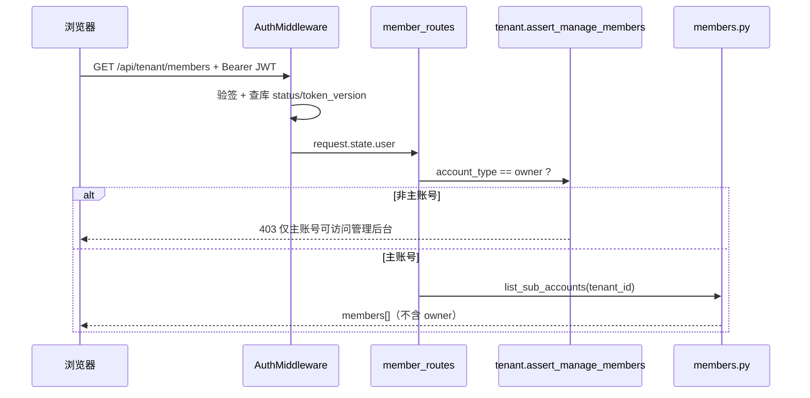
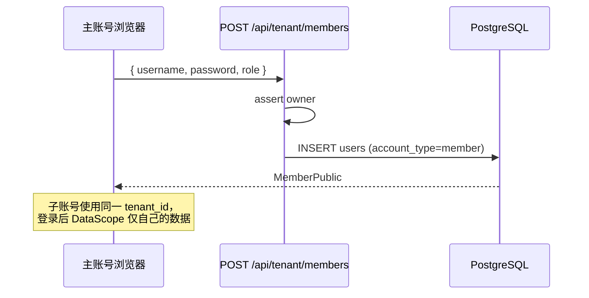
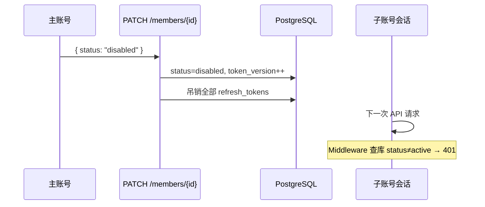

# 主账号管理后台架构设计

> 入口：`http://127.0.0.1:3000/members`  
> 定位：**全局唯一主账号（Owner）专属控制台**，子账号无入口、无 API 权限。  
> 相关文档：[`单点登录.md`](./单点登录.md)（账号体系 + SSO 扩展）

---

## 一、设计目标

| 目标 | 说明 |
|------|------|
| **唯一管理面** | 全系统只有 1 个主账号能进 `/members`，统一管理子账号与（规划中）配额、API 权限 |
| **强隔离** | 子账号只能操作自己的画布 / 素材 / 任务；列表不出现主账号 |
| **低侵入** | 在现有 `auth/` + JSON 落盘架构上增量扩展，不拆微服务 |
| **可演进** | 第一期子账号 CRUD 已落地；第二期配额 / 审计 / SSO 按模块加表、加 Tab |

---

## 二、总体架构

```text
┌─────────────────────────────────────────────────────────────────┐
│                        浏览器（主账号）                           │
│  头像菜单「管理后台」 ──► GET /members ──► static/members.html   │
│                              │                                    │
│                              ▼                                    │
│                     static/js/members.js                          │
│                     static/js/auth.js（JWT / apiFetch）            │
└──────────────────────────────┬──────────────────────────────────┘
                               │ HTTPS / Bearer JWT
                               ▼
┌─────────────────────────────────────────────────────────────────┐
│                     FastAPI（main.py + auth/）                    │
│  ┌──────────────┐  ┌─────────────────┐  ┌──────────────────┐  │
│  │ AuthMiddleware│  │ auth/routes.py  │  │ auth/member_     │  │
│  │ JWT+token_ver │  │ login/me/refresh│  │ routes.py        │  │
│  └──────┬───────┘  └─────────────────┘  │ /api/tenant/*    │  │
│         │                                  └────────┬─────────┘  │
│         │         ┌─────────────────┐               │            │
│         └────────►│ auth/tenant.py  │◄──────────────┘            │
│                   │ DataScope 隔离   │                            │
│                   └────────┬────────┘                            │
│                            │                                      │
│         ┌──────────────────┼──────────────────┐                  │
│         ▼                  ▼                  ▼                  │
│  auth/members.py    auth/service.py     main.py 业务 API          │
│  子账号 CRUD         登录/Token         画布/Provider/任务         │
└──────────────────────────────┬──────────────────────────────────┘
                               │
              ┌────────────────┴────────────────┐
              ▼                                 ▼
     PostgreSQL                          JSON 文件（data/）
     tenants / users /                  providers/{tenant_id}.json
     refresh_tokens                     canvases / conversations …
```

### 2.1 分层职责

| 层级 | 目录 | 职责 |
|------|------|------|
| **页面** | `static/members.html` + `members.js` | 主账号 UI：创建子账号、列表、启停、改权限、重置密码 |
| **网关** | `main.py` | `GET /members` 返回静态页；其余 `/api/*` 走中间件 |
| **认证** | `auth/middleware.py` | 校验 JWT、`status=active`、`token_version` |
| **授权** | `auth/tenant.py` | `assert_manage_members()` → 仅 `account_type=owner` |
| **领域** | `auth/members.py` | 子账号业务规则（不可碰 owner、列表不含 owner） |
| **持久化** | PostgreSQL + JSON | 账号元数据 PG；业务数据按 `tenant_id` / `user_id` 落盘 |

---

## 三、访问控制模型

### 3.1 账号模型（已定稿）

```text
系统
 └── 租户 Tenant（1 个，与主账号同时创建）
      ├── Owner × 1     account_type=owner, role=owner   ← 不可删、不可列表展示
      └── Member × N    account_type=member, role=editor|viewer
```

### 3.2 权限矩阵

| 资源 / 操作 | Owner | Member (editor) | Member (viewer) |
|-------------|-------|-----------------|-----------------|
| `GET /members` 页面 | ✅ | ❌ 403 + 前端跳转 | ❌ |
| `/api/tenant/members` | ✅ | ❌ 403 | ❌ |
| `PUT /api/providers` | ✅ | ❌ | ❌ |
| 画布列表 | 租户内全部 | 仅 `created_by=自己` | 只读自己的 |
| 画布写入 | 全部 | 自己的 | ❌ |
| Provider JSON | 读写 | 只读（前端拦截） | 只读 |

### 3.3 鉴权链路（管理 API）



**关键代码锚点：**

- 中间件：`auth/middleware.py` → `_resolve_authenticated_user`
- 管理入口：`auth/tenant.py` → `assert_manage_members()` 要求 `user.account_type == "owner"`
- 列表过滤：`auth/members.py` → `list_sub_accounts()` 条件 `account_type == "member"`

---

## 四、路由与 API 设计

### 4.1 页面路由

| 方法 | 路径 | 处理 | 鉴权 |
|------|------|------|------|
| GET | `/members` | `static_html_response("members.html")` | 页面本身公开；**JS 内校验主账号** |
| GET | `/login` | 登录页 | 公开 |

> 静态页不强制服务端渲染鉴权（与现有多 HTML 架构一致）；安全依赖 `/api/tenant/*` 403 + 前端 `fetchMe().is_owner`。

### 4.2 管理 API（已实现）

前缀：`/api/tenant`（`auth/member_routes.py`）

| 方法 | 路径 | 说明 | 副作用 |
|------|------|------|--------|
| GET | `/members` | 子账号列表（**不含主账号**） | — |
| POST | `/members` | 创建子账号 | — |
| PATCH | `/members/{id}` | 改 `role` / `status` | `token_version++`，吊销 refresh |
| DELETE | `/members/{id}` | 删除子账号 | 物理删 `users` 行 |
| POST | `/members/{id}/reset-password` | 重置密码 | `token_version++` |

**请求 / 响应模型：** `auth/schemas.py` → `MemberCreateRequest`、`MemberPublic`、`MemberListResponse`

**业务约束（`auth/members.py`）：**

- 创建时强制 `account_type=member`，角色仅 `editor` | `viewer`
- 不可对 owner 行做 PATCH / DELETE
- 用户名全局唯一（`users.username` UNIQUE）

### 4.3 关联 API（非 /members 页，但属管理域）

| API | 页面 | Owner | Member |
|-----|------|-------|--------|
| `GET/PUT /api/providers` | `/api-settings.html` | 读写 | 只读 |
| `GET /api/auth/me` | 头像菜单 | 返回 `is_owner: true` | `is_owner: false` |
| 画布 CRUD `/api/canvases/*` | 画布 | 全租户 | 按 `created_by` 过滤 |

---

## 五、前端架构

### 5.1 入口与导航

```text
登录 ──► 头像菜单（auth.js / auth-menu.css）
              │
              ├─ is_owner ──► 「管理后台」──► /members
              ├─ is_owner ──► 「设置」──────► /api-settings.html
              └─ 所有账号 ──► 「退出登录」
```

子账号：**不渲染**「管理后台」「设置」菜单项。

### 5.2 `/members` 页面结构（当前）

```text
members.html
├── 顶栏：标题 + 「API 配置」+ 「返回首页」
├── Panel：添加子账号表单（username / password / role）
└── Panel：子账号表格（账号 / 权限 / 状态 / 最近登录 / 操作）

members.js
├── ensureAccess()     → initPage + fetchMe，非 owner  alert 并跳转 /
├── loadMembers()      → GET /api/tenant/members
└── 行内操作           → PATCH / DELETE / reset-password
```

### 5.3 规划中的后台布局（第二期）

由单页升级为 **Tab 壳层**，URL 可/hash 路由：

```text
/members                    → 默认 Tab：子账号
/members#quotas             → 资源配额
/members#api-permissions    → 子账号 API 权限
/members#audit              → 操作审计
/members#system             → 系统状态（DB / Redis / 版本）
```

```text
┌────────────────────────────────────────────────────────┐
│ 管理后台                          [API 配置] [返回首页] │
├──────────┬─────────────────────────────────────────────┤
│ 子账号   │  （当前 members 表格 + 创建表单）            │
│ 资源配额 │  ← Phase 2                                  │
│ API 权限 │  ← Phase 2                                  │
│ 操作审计 │  ← Phase 3                                  │
│ 系统信息 │  ← Phase 2                                  │
└──────────┴─────────────────────────────────────────────┘
```

---

## 六、数据模型

### 6.1 PostgreSQL（已有）

```sql
-- 核心表（Alembic 001/002）
tenants (id, name, status, plan, settings JSONB, …)
users (
  id, tenant_id, username UNIQUE,
  password_hash, display_name,
  account_type,  -- 'owner' | 'member'
  role,          -- owner 固定 owner；member 为 editor|viewer
  status,        -- active | disabled
  token_version, -- 禁用/改密/改角色时 +1
  last_login_at, …
)
refresh_tokens (user_id, token_hash, expires_at, revoked_at, …)
```

** invariant：**

```sql
-- 全局最多 1 个 owner（应用层 count_owners() 保证，后续可加 partial unique index）
SELECT COUNT(*) FROM users WHERE account_type = 'owner';  -- 必须 <= 1
```

### 6.2 JSON 业务数据（已有隔离）

| 路径模式 | 隔离键 | Owner 可见 | Member 可见 |
|----------|--------|------------|-------------|
| `data/providers/{tenant_id}.json` | tenant_id | ✅ 读写 | 只读 |
| `data/canvases/*.json` | tenant_id + created_by | 全部 | 自己的 |
| `data/conversations/{tenant_id}/{user_id}/` | tenant_id + user_id | 全部 | 自己的 |
| `data/asset_libraries/{tenant_id}.json` | tenant_id | 全部 | 自己的素材逻辑（待细化） |

隔离逻辑集中于：`auth/tenant.py` → `DataScope`、`canvas_belongs_to_scope()`

### 6.3 规划表（第二期）

```sql
-- 子账号配额
member_quotas (
  user_id UUID PRIMARY KEY REFERENCES users(id),
  max_canvases INT,
  max_storage_mb INT,
  max_daily_generations INT,
  updated_at TIMESTAMPTZ
);

-- 子账号 API 能力（细粒度）
member_api_grants (
  user_id UUID,
  provider_id TEXT,       -- 对应 providers JSON 内 id
  allow_image BOOLEAN,
  allow_video BOOLEAN,
  allow_chat BOOLEAN,
  PRIMARY KEY (user_id, provider_id)
);

-- 管理操作审计
admin_audit_logs (
  id UUID PRIMARY KEY,
  actor_user_id UUID,
  action TEXT,            -- member.create / member.disable / …
  target_user_id UUID,
  detail JSONB,
  created_at TIMESTAMPTZ
);
```

---

## 七、核心流程

### 7.1 创建子账号



### 7.2 禁用子账号（即时生效）



### 7.3 子账号登录后数据边界

```text
JWT 含：user_id, tenant_id, account_type, role, token_version
         │
         ▼
AuthMiddleware 注入 DataScope
         │
         ├─ Owner  →  tenant 内全部 canvas / provider 管理
         └─ Member →  filter created_by == user_id（viewer 另加只读）
```

---

## 八、安全设计

| 项 | 措施 |
|----|------|
| 越权访问 `/members` | 前端 `is_owner` + API `assert_manage_members` 双重校验 |
| 子账号枚举主账号 | 列表 SQL 强制 `account_type='member'` |
| 重复主账号 | `register_owner` / `count_owners()` 拒绝第二次创建 |
| 禁用后仍访问 | `token_version` + DB `status` 双检；refresh 吊销 |
| 密码存储 | bcrypt；重置后强制重新登录 |
| CSRF | 同源 + Bearer Token；refresh 用 HttpOnly Cookie |
| 审计 | Phase 3：`admin_audit_logs` 记录所有管理写操作 |

---

## 九、模块与文件映射

```text
auth/
├── routes.py           # /api/auth/*  登录、me（is_owner）
├── member_routes.py    # /api/tenant/members*  ← 管理 API 入口
├── members.py          # 子账号领域逻辑
├── tenant.py           # DataScope、assert_manage_members
├── middleware.py       # 全站 API 鉴权
├── service.py          # register_owner、count_owners、issue_tokens
├── schemas.py          # Member* Pydantic 模型
└── models.py           # SQLAlchemy User / Tenant

static/
├── members.html        # 管理后台页
├── js/members.js       # 管理页逻辑
├── js/auth.js          # 登录、头像菜单、apiFetch
└── css/auth-menu.css   # 头像下拉

main.py
├── GET /members        # 页面路由
└── 画布/Provider/…    # 业务 API（读 DataScope）

tools/
├── reset_auth_accounts.py   # 清空账号、重新初始化
└── check_auth_db.py         # 诊断 users/owners 数量
```

---

## 十、实施分期

### Phase 1（已完成）— 子账号管理 MVP

- [x] 全局唯一主账号 + 子账号 CRUD
- [x] `/members` 页面 + `/api/tenant/members`
- [x] 头像菜单「管理后台」仅 owner
- [x] 画布 / Provider 按 DataScope 隔离
- [x] 禁用 / 改角色 / 重置密码 → token 失效

### Phase 2 — 配额与 API 权限

- [ ] `member_quotas` 表 + 管理 Tab
- [ ] 创建画布 / 上传 / 生图前检查配额
- [ ] `member_api_grants`：按子账号限制 Provider 与能力（文生图 / 视频 / 对话）
- [ ] 管理后台「系统信息」：DB 连接、AUTH_MODE、用户统计

### Phase 3 — 审计与 SSO

- [ ] `admin_audit_logs` + 后台只读列表
- [ ] 对接 [`单点登录.md`](./单点登录.md) Hub；管理后台仍仅 owner JWT
- [ ] Redis 缓存 `token_version`、强制下线广播

### Phase 4 — 体验与运维

- [ ] `members.html` 抽成 `admin/` 多 Tab 壳层（或轻量 SPA）
- [ ] 子账号详情抽屉：画布数、最近任务、存储占用
- [ ] 批量导入子账号（CSV）
- [ ] 主账号改密（无需走子账号 reset 接口）

---

## 十一、与 SSO / 单点登录的关系

管理后台 **不单独做一套登录**：

- 仍用现有 JWT；SSO 上线后，Hub 登录 → 各应用换本地 Token → owner 的 JWT 含 `account_type=owner` → 可进 `/members`
- SSO 会话失效 ≠ 自动开放管理后台；**以 JWT + DB owner 校验为准**
- 详见 [`单点登录.md` 账号体系章节](./单点登录.md#账号体系已定稿)

---

## 十二、本地验证清单

1. `docker compose -f docker-compose.auth.yml up -d`
2. `run-auth.bat` 或 `API/.env` + `run.bat`
3. 主账号登录 → 头像 → 「管理后台」→ `http://127.0.0.1:3000/members`
4. 创建子账号 → 子账号登录 → 确认无管理入口、仅见自己的画布
5. 禁用子账号 → 确认立即 401
6. `GET /api/auth/status` → `has_owner: true`

诊断命令：

```powershell
.\python\python.exe tools\check_auth_db.py
```

---

## 十三、总结

`/members` 管理后台是 **Owner 专属控制平面**，不是独立产品：

- **现在**：子账号生命周期管理 + 与 JSON 业务数据的租户/用户隔离联动  
- **下一步**：在同一壳层下扩展 **配额、API 授权、审计**  
- **原则**：主账号唯一、列表不含 owner、所有写操作走 PostgreSQL 且可吊销 Token  

若 Phase 2 开工，建议顺序：`member_quotas` → 生图/画布入口校验 → 后台 Tab UI。
