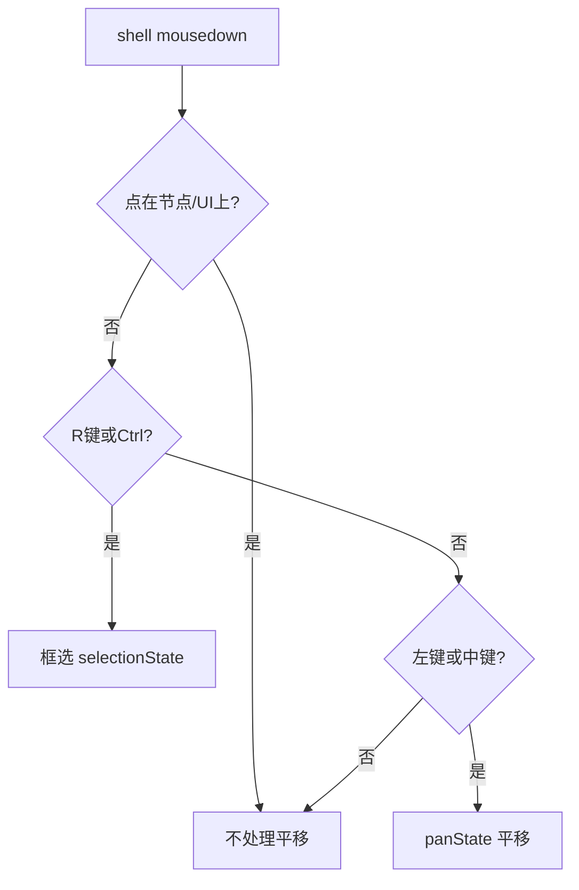
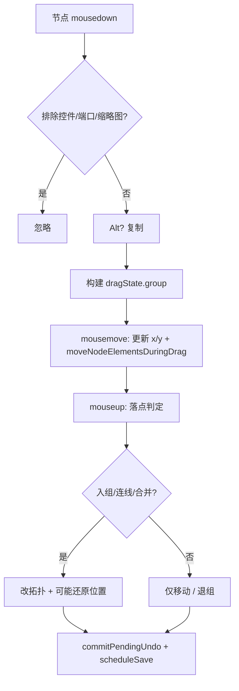

# 节点拖动与画布移动

本文档说明**智能画布**（`static/js/smart-canvas.js`）与**普通无限画布**（`static/js/canvas.js`）中，节点拖拽与画布平移/缩放的实现与完整流程。Mac 用户将 `Ctrl` 换为 `⌘`。

---

## 一、坐标系与视口模型

两种画布共用同一套思路：**世界坐标**存节点 `x/y`，**视口**用 CSS transform 平移缩放整个 `world` 层。

| 概念 | 智能画布 | 普通画布 |
|------|----------|----------|
| 容器 | `#shell` | `#board` |
| 世界层 | `#world` | `#world` |
| 视口状态 | `viewport = {x, y, scale}` | 同左 |
| 屏幕→世界 | `screenToWorld(event)` | `screenToWorld(clientX, clientY)` |
| 应用视口 | `applyViewport()` | `applyViewport()` |

**变换公式**（智能画布）：

```1732:1741:static/js/smart-canvas.js
function applyViewport(){
    world.style.transform = `translate(${viewport.x}px, ${viewport.y}px) scale(${viewport.scale})`;
    world.classList.toggle('canvas-scaled', Math.abs(viewport.scale - 1) > 0.001);
    renderMinimap();
}
```

**屏幕坐标转世界坐标**：

```1743:1748:static/js/smart-canvas.js
function screenToWorld(event){
    const rect = shell.getBoundingClientRect();
    return {
        x:(event.clientX - rect.left - viewport.x) / viewport.scale,
        y:(event.clientY - rect.top - viewport.y) / viewport.scale
    };
}
```

节点拖动时，鼠标位移需除以 `viewport.scale` 才等于世界坐标位移：

```15063:15064:static/js/smart-canvas.js
    const moveDx = (e.clientX - dragState.startX) / viewport.scale;
    const moveDy = (e.clientY - dragState.startY) / viewport.scale;
```

视口会随画布保存：`canvas.viewport = {...viewport}`。

---

## 二、智能画布：画布移动（平移）

### 2.1 用户操作

| 操作 | 效果 |
|------|------|
| **空白处左键拖动** | 平移画布 |
| **中键拖动** | 平移画布（`button === 1`） |
| **滚轮** | 以光标为中心缩放 |
| **小地图拖动** | 视野跳转到对应世界点 |
| `Ctrl` / `R` + 空白拖动 | **框选**，不是平移 |

### 2.2 事件入口：`shell.onmousedown`

空白处（非节点、非 UI 浮层）按下时建立 `panState`：

```14757:14779:static/js/smart-canvas.js
shell.onmousedown = e => {
    // zoom 预览模式、点在节点/UI 上 → 直接 return
    closeCreateMenu();
    if(e.button === 0 && isRKeyDown){ /* 框选 */ return; }
    if(e.button === 0 && (e.ctrlKey || e.metaKey)){ /* 框选 */ return; }
    if(e.button !== 0 && e.button !== 1) return;
    e.preventDefault();
    didPan = false;
    panState = {button:e.button, startX:e.clientX, startY:e.clientY, ox:viewport.x, oy:viewport.y};
    shell.classList.add('panning');
};
```

**不会启动平移的区域**（节选）：`.image-node`、`.composer`、资源库、快捷键面板、创建菜单、小地图等。

### 2.3 拖动过程：`window.onmousemove`

```15051:15058:static/js/smart-canvas.js
    if(panState){
        const dx = e.clientX - panState.startX;
        const dy = e.clientY - panState.startY;
        if(Math.abs(dx) + Math.abs(dy) > 3) didPan = true;
        viewport.x = panState.ox + dx;
        viewport.y = panState.oy + dy;
        applyViewport();
        return;
    }
```

- 位移超过 3px 时 `didPan = true`，用于区分「点击空白」与「拖动画布」
- 只改 `viewport.x/y`，不触发全量 `render()`

### 2.4 松开：`window.onmouseup`

```15153:15157:static/js/smart-canvas.js
    if(panState) {
        panState = null;
        shell.classList.remove('panning');
        scheduleSave();
        setTimeout(() => { didPan = false; }, 0);
    }
```

### 2.5 `didPan` 的副作用

平移结束后同一手势内会抑制：

- `shell.oncontextmenu` 打开创建菜单
- `shell.ondblclick` 打开创建菜单
- `shell.onclick` 清空选中

避免「拖完画布误弹菜单 / 误清选区」。

### 2.6 滚轮缩放

```15269:15281:static/js/smart-canvas.js
shell.addEventListener('wheel', e => {
    // 点在 composer、提示词编辑区等 UI 上则忽略
    e.preventDefault();
    const before = {x:(sx - viewport.x) / viewport.scale, y:(sy - viewport.y) / viewport.scale};
    viewport.scale = safeScale(viewport.scale * Math.exp(-e.deltaY * 0.001));
    viewport.x = sx - before.x * viewport.scale;
    viewport.y = sy - before.y * viewport.scale;
    applyViewport();
    scheduleSave();
}, {passive:false});
```

### 2.7 小地图平移

```14816:14821:static/js/smart-canvas.js
minimap?.addEventListener('mousedown', e => {
    smartMinimapDrag = true;
    centerViewportOnWorldPoint(minimapEventToWorld(e));
});
```

`mousemove` 中持续 `centerViewportOnWorldPoint`，松开时 `smartMinimapDrag = false`。

---

## 三、智能画布：节点拖动

### 3.1 状态结构 `dragState`

```javascript
dragState = {
  id,           // 主拖动节点 id
  startX, startY, // 屏幕起点
  ox, oy,       // 主节点世界坐标起点
  group: [{id, ox, oy}, ...],  // 一起移动的节点快照
  groupIds,     // 上述 id 列表
  ctrlGroup: Boolean(e.ctrlKey), // 是否启用 Ctrl 增强拖放
  thumbDetached // 从缩略图拖出单张后为 true
}
```

全局变量：`let dragState = null`（约第 76 行）。

### 3.2 启动拖动：`beginNodeDrag`

绑定在每张 `.image-node` 的 `onmousedown`（`bindNodeEvents`）：

```7901:7921:static/js/smart-canvas.js
        const beginNodeDrag = e => {
            if(e.button !== 0 || e.target.closest('.mini-x, .smart-node-floating-menu, .node-resize-handle, .thumb-item, .node-port, .prompt-node-control, select, input, textarea, button')) return;
            if(e.target.closest('.prompt-node-pill, textarea:not(.prompt-node-text)')) return;
            e.preventDefault(); e.stopPropagation();
            // ...
            if(e.altKey) node = duplicateForAltDrag(node);
            let dragIds = selectedIds.includes(node.id) ? selectedIds.slice() : [node.id];
            if(isSmartGroupNode(node)){
                const memberIds = smartGroupMembers(node).map(member => member.id);
                dragIds = Array.from(new Set([...dragIds, ...memberIds]));
            }
            const group = dragIds.map(dragId => ({id, ox, oy}));
            dragState = {id:node.id, startX, startY, ox, oy, group, groupIds, ctrlGroup:Boolean(e.ctrlKey)};
            document.body.classList.add('smart-node-drag');
            capturePendingUndo();
        };
```

**不会启动节点拖动的区域**：删除钮、浮动菜单、缩放手柄、缩略图、端口、表单控件、提示词药丸等。

**多选联动**：若被拖节点在 `selectedIds` 中，整组 `selectedIds` 一起进 `group`。

**智能分组**：拖动分组时自动把 `smartGroupMembers` 并入 `group`。

**Alt + 拖动**：先 `duplicateForAltDrag` 复制再拖副本。

**撤销**：`capturePendingUndo()` 在按下时快照；松手时 `commitPendingUndo()` 或 `discardPendingUndo()`。

### 3.3 拖动中：`window.onmousemove`

1. 按 `group` 快照更新每个节点的 `x/y`
2. `moveNodeElementsDuringDrag()` 只改 DOM `left/top`（不全量 render）
3. 若 `ctrlGroup`：计算落点高亮、自动连线目标、入组目标等
4. `scheduleInteractionLayerRefresh()` 节流刷新连线层 + 小地图

```5785:5800:static/js/smart-canvas.js
function moveNodeElementsDuringDrag(){
    groupItems.forEach(id => {
        el.style.left = `${n.x}px`;
        el.style.top = `${n.y}px`;
    });
    if(active) positionComposerForNode(active);  // 选中节点拖动时 Composer 跟随
    scheduleInteractionLayerRefresh();
}
```

### 3.4 松开：`window.onmouseup` 落点逻辑

按优先级依次尝试：

| 顺序 | 条件 | 行为 |
|------|------|------|
| 1 | 拖到资源库面板 | 保存图片到库，**位置还原**，`discardPendingUndo` |
| 2 | 循环节点 + Ctrl + 命中连线 | `insertLoopNodeIntoConnection` |
| 3 | 命中智能分组 | `addDraggedNodesToSmartGroup` |
| 4 | Ctrl + 命中多图节点(≥2张) | `mergeImageNodesIntoGroup` |
| 5 | Ctrl + 可连线目标 | `connectInputNode`，**位置还原** |
| 6 | 仅移动 | 更新坐标；提示词/循环 `pruneSmartGroupMembershipsForNode` 退组 |
| — | 无实质移动 | `discardPendingUndo` |

```15259:15266:static/js/smart-canvas.js
        if(stateChanged) commitPendingUndo();
        else discardPendingUndo();
        if(stateChanged || dragState.thumbDetached) suppressNodeClickUntil = Date.now() + 180;
        dragState = null;
        scheduleSave();
        scheduleConnectionLayerRefresh();
```

`suppressNodeClickUntil` 防止拖完误触发节点 `click` 选中。

### 3.5 缩略图拖出（与节点拖动的衔接）

从多图节点/分组内拖单张缩略图，移动 >6px 后：

1. 从 `source.images` 剥离该图
2. `createImageNodeAt` 新建节点
3. 立即设 `dragState` 并设 `thumbDetached: true`，继续拖新节点

见 `thumbDragState` 分支（约 15017–15049 行）。

---

## 四、智能画布：框选（与平移互斥）

| 触发 | 代码 |
|------|------|
| `Ctrl` + 空白左键拖 | `selectionState = {startScreen, startWorld}` |
| `R` 按住 + 空白左键拖 | 同上 |

`finishSelection` 用世界坐标矩形与 `nodeRect` 相交求 `selectedIds`。

框选结束后 `selectionJustFinished = true`，抑制紧接着的 `shell.onclick` 清选。

---

## 五、普通无限画布：差异对照

### 5.1 画布平移

入口 `board.onmousedown` → `startBoardPan`：

```13692:13740:static/js/canvas.js
function startBoardPan(e, opts={}){
    dragBoard = {sx, sy, ox:viewport.x, oy:viewport.y, moved:false, clearSelectionOnClick};
    document.body.classList.add('canvas-board-pan');
    window.onmousemove = e2 => {
        viewport.x = dragBoard.ox + e2.clientX - dragBoard.sx;
        viewport.y = dragBoard.oy + e2.clientY - dragBoard.sy;
        applyViewport();
    };
    window.onmouseup = endDrag;
}
```

| 对比项 | 智能画布 | 普通画布 |
|--------|----------|----------|
| 平移状态变量 | `panState` | `dragBoard` |
| 左键空白拖 | ✅ | ✅ |
| 中键拖 | ✅ | ✅（优先于其他逻辑） |
| 点击空白清选 | `shell.onclick` + `didPan` | `clearSelectionOnClick` + `dragBoard.moved` |
| 事件绑定 | 全局 `window.onmousemove` | 临时 `window.onmousemove/onmouseup` |
| 滚轮缩放因子 | `exp(-deltaY * 0.001)` | `×0.92 / ×1.08` |

### 5.2 节点拖动

```13086:13130:static/js/canvas.js
function startNodeDrag(e, node){
    if(e.altKey){ /* clone 后拖副本 */ }
    // 分组：收集 items 内子节点
    // 多选：selected 内其他节点一并 collect
    dragNode = {node, children, sx, sy, ox, oy};
    window.onmousemove = onNodeDrag;
    window.onmouseup = endDrag;
}
```

| 对比项 | 智能画布 | 普通画布 |
|--------|----------|----------|
| 状态变量 | `dragState` + `group[]` | `dragNode` + `children[]` |
| 拖动时 DOM | `moveNodeElementsDuringDrag` 改 style | `onNodeDrag` 改 style |
| 松手入组/连线 | Ctrl 拖放丰富逻辑 | `updateGroupMembership`（仅普通 group） |
| 撤销 | `capturePendingUndo` / `commit` | `endDrag` 内 `scheduleSave`，无 pending 机制 |
| Shift 刀工具 | 无 | `startKnifeDrag` 优先于节点拖 |

---

## 六、流程图

### 6.1 智能画布：空白处按下



### 6.2 智能画布：节点拖动



---

## 七、关键状态变量速查

### 智能画布 `smart-canvas.js`

| 变量 | 含义 |
|------|------|
| `viewport` | `{x, y, scale}` 视口 |
| `panState` | 画布平移进行中 |
| `didPan` | 本次手势是否发生了平移 |
| `dragState` | 节点拖动进行中 |
| `selectionState` | 框选进行中 |
| `smartMinimapDrag` | 小地图拖动 |
| `thumbDragState` | 缩略图拖出单张 |
| `portDragState` | 端口拖线（非节点平移） |
| `lastMouseWorld` | 最近鼠标世界坐标（粘贴等用） |
| `pendingUndoSnapshot` | 拖动开始前快照，松手 commit/discard |

### 普通画布 `canvas.js`

| 变量 | 含义 |
|------|------|
| `viewport` | 视口 |
| `dragBoard` | 画布平移 |
| `dragNode` | 节点拖动 |
| `selectDrag` | 框选 |
| `minimapDrag` | 小地图 |
| `lastMouseBoard` | 鼠标世界坐标 |

---

## 八、源码索引

| 能力 | 文件 | 函数 / 位置 |
|------|------|-------------|
| 视口变换 | `smart-canvas.js` | `applyViewport` ~1732 |
| 坐标换算 | `smart-canvas.js` | `screenToWorld` ~1743 |
| 画布平移入口 | `smart-canvas.js` | `shell.onmousedown` ~14757 |
| 平移移动 | `smart-canvas.js` | `window.onmousemove` `panState` ~15051 |
| 节点拖启动 | `smart-canvas.js` | `beginNodeDrag` ~7901 |
| 节点拖移动 | `smart-canvas.js` | `moveNodeElementsDuringDrag` ~5785 |
| 节点拖结束 | `smart-canvas.js` | `window.onmouseup` `dragState` ~15162 |
| 滚轮缩放 | `smart-canvas.js` | `shell` `wheel` ~15269 |
| 小地图 | `smart-canvas.js` | `centerViewportOnWorldPoint` ~1800 |
| 待提交撤销 | `smart-canvas.js` | `capturePendingUndo` / `commitPendingUndo` ~183 |
| 普通画布平移 | `canvas.js` | `startBoardPan` ~13692 |
| 普通画布拖节点 | `canvas.js` | `startNodeDrag` / `onNodeDrag` ~13086 |

---

## 九、常见问题

**Q：为什么拖节点时连线会跟动但不太卡？**  
A: 节点位置用 `el.style.left/top` 即时更新；连线 SVG 通过 `scheduleInteractionLayerRefresh` 每帧最多刷新一次。

**Q：拖画布后为什么会误开右键菜单？**  
A: 不应发生——`didPan` 为 true 时 `oncontextmenu` 会 return。若位移 <3px 仍算点击，可能触发菜单。

**Q：Ctrl 拖动节点和不按 Ctrl 有何区别？**  
A: `ctrlGroup=true` 时松手可自动连线、并入分组、合并多图、循环插入连线；不按 Ctrl 仅移动坐标（智能分组上拖入另有 `smartGroupTarget` 逻辑）。

**Q：普通画布和智能画布能混用文档吗？**  
A: 交互相似但实现分离：智能画布用全局 `window.onmousemove`；普通画布在拖动时临时挂载 `onmousemove/onmouseup`。

---

*以 `static/js/smart-canvas.js`、`static/js/canvas.js` 当前源码为准。*
