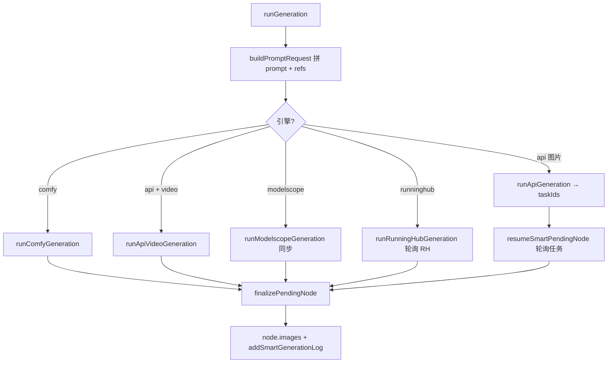
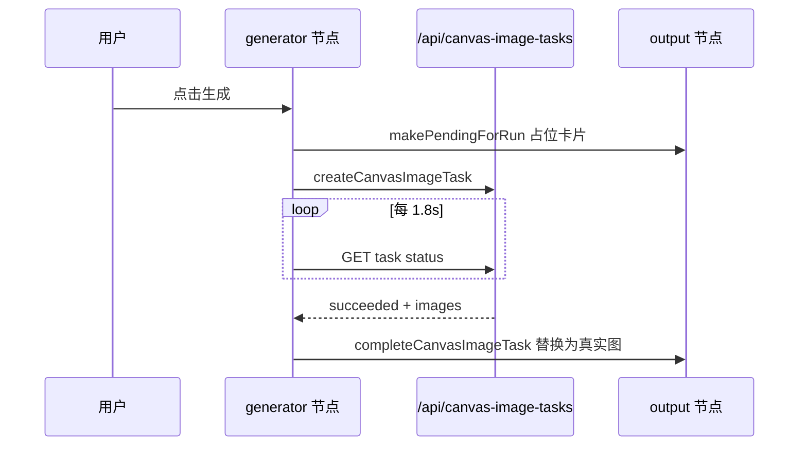

# 图片与视频生成

本文档说明本项目中**图片生成**与**视频生成**的完整流程：从用户触发、后端 API、结果落盘位置，到前端的**加载态 / 进度显示 / 预览态**分别在哪些文件与函数中实现。

Mac 用户将 `Ctrl` 换为 `⌘`。

---

## 一、项目入口总览

| 入口 | 文件 | 生成方式 | 结果展示位置 |
|------|------|----------|--------------|
| **智能画布**（主产品） | `static/smart-canvas.html` + `smart-canvas.js` | Composer 运行 / 一键级联 / 循环 | 图片节点 `node.images[]` |
| **普通无限画布** | `static/canvas.html` + `canvas.js` | 生成器 / 视频 / MS / Comfy / RH 节点 | 下游 **output 节点** `out.images[]` |
| **在线生图** | `static/online.html` | 单页表单 | `#outputImg` + 历史瀑布流 |
| **ZImage / Angle / Klein / Enhance** | `static/zimage.html` 等 | 独立工作室 | 各自预览区 / 瀑布流 |
| **GPT 聊天生图** | `static/gpt-chat.html` | 对话模式 `image` | 气泡内 `.generated-grid` |

下文以**智能画布**与**普通画布**为主；独立工作室的进度 UI 模式在第九章简述。

---

## 二、生成结果存在哪

### 2.1 服务端文件

后端将本地生成物写入 `output/` 或 `assets/`，通过 URL 访问：

```4684:4695:main.py
def output_url_for(filename, category="output"):
    ...
def output_path_for(filename, category="output"):
    ...
```

常见 URL 形态：

- 图片：`/output/studio_xxx.png`、`/output/cloud_angle_xxx.png`
- 视频：`/output/xxx.mp4`
- 远程 URL：上游 API 直链（未落盘时前端直接用 http(s)）

### 2.2 智能画布：节点数据

生成完成后写入选中图片节点的 `images` 数组：

```12453:12482:static/js/smart-canvas.js
function finalizePendingNode(pendingNode, urls, meta, kind='image'){
    ...
    pendingNode.images = imgs;
    pendingNode.outputKind = kind;  // 'image' | 'video' | 'audio' | 'text'
    ...
}
```

每项典型字段：`{ url, name, kind, generatedResult:true, natural_w, natural_h }`。

**落点规则**（`runGeneration`）：

| 场景 | 结果写到哪 |
|------|------------|
| 空节点首次生成 | 当前节点 `node.images` |
| 节点已有图 / 分组再生成 | 右侧新建分支节点 `createPendingOutputFromSource` |
| API 异步多任务 | 同节点，`pendingTasks` 轮询完成后逐个 `finalizeSmartPendingTask` 追加 |
| 视频 API | `finalizePendingNode(..., 'video')`，缩略图走 `smartVideoPreviewHtml` |

### 2.3 普通画布：output 节点

生成类节点不直接显示大图，而是自动连到右侧 **output 节点**：

```9514:9525:static/js/canvas.js
function outputForNode(node, dx=460){
    ...
    out = {id:uid('out'), type:'output', x:node.x + dx, y:node.y, images:[]};
    ...
}
```

完成时 `appendOutputImages(out, images)` 把 URL 追加到 `out.images`；源节点 `generatedOutputs` 也保留一份供连线引用。

---

## 三、智能画布：生成主流程

### 3.1 用户如何触发

1. 选中图片节点 / 分组 / 循环下游节点  
2. 底部 **Composer** 填写提示词、选引擎与参数  
3. 点击 **运行** → `runGeneration()`  
4. 或 **一键运行** → `runSmartCascade()`（沿连线批量跑）

运行按钮禁用逻辑：`syncRunButtonState` — 仅当**当前选中节点**在飞行中（`pending` / `running` / `jimengPending` / 循环占用）时禁用。

### 3.2 `runGeneration` 流程概览



核心入口：

```13646:13748:static/js/smart-canvas.js
async function runGeneration(){
    ...
    if(settings.engine === 'comfy'){ await runComfyGeneration(...); ... }
    if(isApiLikeEngine(settings.engine) && settings.apiKind === 'video'){
        const outVideos = await runApiVideoGeneration(prompt, refs);
        finalizePendingNode(pendingNode, outVideos, pendingMeta, 'video');
        ...
    }
    const outImages = settings.engine === 'runninghub' ? await runRunningHubGeneration(...)
        : settings.engine === 'modelscope' ? await runModelscopeGeneration(...)
        : await runApiGeneration(...);
    if(isApiLikeEngine(settings.engine)){
        pendingNode.pendingTasks = taskIds.map(...);
        await resumeSmartPendingNode(pendingNode, ...);
        ...
    }
    finalizePendingNode(pendingNode, outImages, pendingMeta);
}
```

### 3.3 各引擎与后端 API

| 引擎 | 前端函数 | 后端接口 | 同步/异步 |
|------|----------|----------|-----------|
| API 图片 | `runApiGeneration` | `POST /api/canvas-image-tasks` | 异步任务 + 前端轮询 |
| API 视频 | `runApiVideoGeneration` | `POST /api/canvas-video` | 后端阻塞轮询上游，前端一次 await |
| ModelScope | `runModelscopeGeneration` | `/api/ms/generate`、`/api/angle/generate`、`/generate` | 多数同步等 URL |
| ComfyUI | `runComfyGeneration` | `POST /api/generate` 或 `canvas-comfy-tasks` | 队列 + 轮询 |
| RunningHub | `runRunningHubGeneration` | `/api/runninghub/submit` + `query` | 前端每 2.5s 轮询 |

**API 图片提交**：

```13867:13875:static/js/smart-canvas.js
async function runApiGeneration(prompt, refs, runSettings=settings){
    const payload = {prompt, provider_id, model, size, quality, n:1, reference_images:...};
    const tasks = await Promise.all(Array.from({length:count}, () =>
        fetch('/api/canvas-image-tasks', {method:'POST', ...})
    ));
    return {taskIds: tasks.map(t => t.task_id), ...};
}
```

**API 视频提交**：

```13967:13973:static/js/smart-canvas.js
const result = await fetch('/api/canvas-video', {method:'POST', body:JSON.stringify(payload)});
if(result.jimeng_pending) throw new JimengPendingSignal(...);
return resultMediaUrls(result);
```

后端 `canvas_video` 按 provider 分发（即梦、RunningHub、APIMart、火山、玉玉、Agnes 等），内部 `wait_for_video_task` 轮询上游直至成功或超时。

---

## 四、智能画布：加载与进度 UI

智能画布**没有**传统「0%–100%」进度条（除即梦队列文案）；用**骨架屏 + 计时胶囊 + 特殊待查询态**表达进度。

### 4.1 状态字段

| 字段 | 含义 |
|------|------|
| `node.pending` | 预期产出张数（>0 且尚无图 → 显示骨架） |
| `node.running` | Comfy / MS 等同步引擎运行中 |
| `node.queued` | 级联排队，显示灰色 queued 骨架 |
| `node.pendingTasks[]` | API 异步任务 `{taskId, kind, failed, recoverTaskId}` |
| `node.jimengPending` | 即梦长任务 `{submitId, queueInfo, querying}` |
| `node.runStartedAt` / `runFinishedAt` / `runElapsedMs` | 计时 |
| `node.runTimerHidden` | 完成后是否隐藏计时胶囊 |

### 4.2 节点内骨架屏（`nodeBodyHtml`）

```6770:6778:static/js/smart-canvas.js
if(node.queued && imgs.length === 0 && !node.pending){
    return `<div class="loading-cell single queued" ...></div>`;
}
if(node.pending && imgs.length === 0){
    if(count <= 1) return `<div class="loading-cell single" ...></div>`;
    return `<div class="loading-skeleton">...多个 loading-cell...</div>`;
}
```

样式：`static/css/smart-canvas.css` — `.loading-cell` 流光动画（`shimmer`），`.loading-skeleton` 宫格布局。

### 4.3 运行计时胶囊（`run-time-pill`）

```6965:6990:static/js/smart-canvas.js
function runTimePillHtml(node){
    const running = Boolean(node.pending || node.running || node.jimengPending);
    return `<span class="run-time-pill${running ? '' : ' done'}" data-run-timer="...">`;
}
function refreshRunTimerPills(){
    ... setInterval(refreshRunTimerPills, 1000);
}
```

- 运行中：蓝色胶囊，每秒刷新 `formatRunDuration`  
- 完成：绿色 `.done`，约 3s 后可 `hideRunTimerForNode` 自动隐藏  

CSS：`.run-time-pill` / `.run-time-pill.done`（`smart-canvas.css` 约 457 行）。

### 4.4 即梦待查询态（`jimeng-pending`）

上游返回 `jimeng_pending` 时，节点显示旋转图标 + 队列文案 + **「查询结果」**按钮：

```6792:6803:static/js/smart-canvas.js
function jimengPendingBodyHtml(node, layout){
    return `<div class="jimeng-pending-cell loading-cell single">
        <div class="jimeng-pending-spinner">...</div>
        <div class="jimeng-pending-text">${jimengQueueText(jp.queueInfo)}</div>
        <button data-jimeng-query="...">查询结果</button>
    </div>`;
}
```

页面加载时 `resumeJimengPendingNodes()` 自动恢复轮询。

### 4.5 API 图片任务失败可恢复态

轮询失败但带 `upstream_task_id` 时进入 `imageTaskRecoverBodyHtml`（样式同即梦待查询），按钮 `data-image-task-query` 手动查询。

轮询实现：

```14359:14377:static/js/smart-canvas.js
async function pollSmartCanvasTask(taskId){
    for(let i = 0; i < 900; i++){
        await sleep(2000);
        const task = await fetch(`/api/canvas-image-tasks/${taskId}`).then(r => r.json());
        if(task.status === 'succeeded') return task.result;
        if(task.status === 'jimeng_pending') throw new JimengPendingSignal(...);
        if(task.status === 'failed') ...
    }
}
```

### 4.6 Composer 运行按钮

`syncRunButtonState`：选中节点忙时 `runBtn.disabled = true`。  
API 类引擎用 `coolNodeRunningState(pendingNode, 2000)` — 约 2s 后可再次点击，任务仍在后台 `pendingTasks` 追踪（与普通画布并发策略一致）。

### 4.7 生成日志

`addSmartGenerationLog` 写入 `canvas.logs[]`，侧边栏「生成日志」可查看平台、模型、耗时、输出 URL、错误信息。  
智能画布 HTML：`smart-canvas.html` 中 `#smartLogPanel`。

---

## 五、智能画布：预览态

### 5.1 节点缩略图

- 图片：`smartPreviewImgHtml` → `/api/media-preview?w=...` 缩略代理  
- 视频：`smartVideoPreviewHtml` → 静态封面 + `data-preview-kind="video"`，点击可内联播放  

### 5.2 全屏预览 / 编辑模态框

| 操作 | 函数 | UI |
|------|------|-----|
| 工具栏「预览」 | `openImagePreview` → `openImageEditor` + `setImageEditMode('preview')` | `#imageEditModal` |
| 双击节点图片 | `openImagePreviewSmart`（分组内走整组序列） | 同上 |
| 视频预览 | `setImageEditMode` 强制 `preview`，显示 `#videoFrameTools` | 视频仅预览，无裁剪 |

`setImageEditMode('preview')` 切换：

- `#previewStage` 显示，`#cropCanvas` 隐藏  
- 视频：`.video-preview-mode`，隐藏裁剪工具条  
- 图片：显示对比 / 全景按钮、`#imagePreviewTools`  

```8471:8524:static/js/smart-canvas.js
function setImageEditMode(mode, userTouched=false){
  ...
  previewStageEl.style.display = isPreview ? 'inline-flex' : 'none';
  editPanelEl?.classList.toggle('video-preview-mode', isVideoPreview);
}
```

### 5.3 画布 zoom 预览

双击空白或快捷键可进入 `shell.zoom-preview` 模式（`enterZoomPreview`），与编辑模态框独立，用于快速查看节点大图。

### 5.4 循环运行中的「输入预览」

`showDirectLoopRoundPreview`：循环每轮先把上游 refs 填进目标节点并 `running=true`，显示输入图预览，再异步生成；完成后 `finishLoopTargetPreviewState`。

---

## 六、普通无限画布：图片生成

### 6.1 流程



`runGenerator` 核心：

```9745:9806:static/js/canvas.js
async function runGenerator(genId, opts={}){
    ...
    const taskInfos = await Promise.all(...createCanvasImageTask...);
    out._pending = [...taskInfos.map(...makePendingForRun...)];
    const statuses = await Promise.all(taskInfos.map(t => pollCanvasImageTask(t.task_id)));
}
```

### 6.2 output 节点加载 UI

```5548:5565:static/js/canvas.js
function renderPendingOutput(pending){
    if(pending?.failed) return `...output-recover-state...查询结果...`;
    return `<div class="output-img-wrap loading-wrap">
        <span class="output-time-pill running">${formatRunDuration(...)}</span>
        <div class="output-spinner"></div>
    </div>`;
}
```

- **转圈**：`.output-spinner`（`canvas.css`）  
- **计时**：`.output-time-pill.running`  
- **失败可恢复**：`.output-recover-query` + `recoverTaskId`  

节点角标：`node.runStatus` → `queued` / `running` / `done` / `failed`（`renderNodeStatus`）。

### 6.3 预览

- 图片节点 / output 图：右键菜单「预览」→ `openImageEditor(id, 'preview')`  
- 视频 output：`data-preview-kind="video"` + `canvasActivateVideoPreview`  
- 全屏：`zoom-preview` 类（与智能画布类似）

---

## 七、普通无限画布：视频生成

### 7.1 流程

`runVideoNode` → `POST /api/canvas-video`（**同步等待**后端完成）→ `appendOutputImages` 写入 output 节点。

```9886:9938:static/js/canvas.js
async function runVideoNode(nodeId, opts={}){
    ...
    if(out) out._pending = [...makePendingForRun(pendingId, ...)];
    const result = await cascadeFetch('/api/canvas-video', {...});
    appendOutputImages(out, outputUrls, refs[0], [{...meta, kind:'video'}]);
}
```

视频节点 UI：`renderVideoBody` — 提供商、模型、时长、画幅、参考图、首末帧角色等；生成中 `gen-btn.running` + `node.running`。

**注意**：视频请求期间 output 仅显示**一个** pending 转圈卡片，**无**百分比进度；耗时由 `output-time-pill` 与后端 `VIDEO_POLL_TIMEOUT` 决定。

---

## 八、后端任务与轮询

### 8.1 画布图片异步任务

```11160:11184:main.py
@app.post("/api/canvas-image-tasks")
async def create_canvas_image_task(...):
    CANVAS_TASKS[task_id] = {"status": "queued", ...}
    asyncio.create_task(run_canvas_image_task(task_id, payload))
    return {"task_id": task_id, "status": "queued"}

@app.get("/api/canvas-image-tasks/{task_id}")
async def get_canvas_image_task(task_id: str):
    return task  # status: queued | running | succeeded | failed | jimeng_pending
```

`run_canvas_image_task` 内部调用 `generate_ai_image`，成功后 `result.images` 为 URL 列表。

### 8.2 视频

`POST /api/canvas-video` → 各 provider 提交任务 → `wait_for_video_task` 循环 GET 上游（间隔 ≥2s，`VIDEO_POLL_TIMEOUT` 截止）→ 返回 `{ videos: [...] }` 或即梦 `jimeng_pending`。

### 8.3 在线生图（独立页 / 旧路径）

`POST /api/online-image` — 同步等待，直接返回 `{ images: [...] }`；普通画布 `runGeneratorLegacy` 仍可用此接口。

---

## 九、独立工作室页的进度 UI

这些页面**不在画布节点**里展示结果，但有各自的加载反馈：

| 页面 | 加载 UI | 进度条 | 结果位置 |
|------|---------|--------|----------|
| `online.html` | `#loader` 旋转 + 「Generating」 | 无 | `#outputImg` + 历史卡片 |
| `angle.html` | `#loadingState` | **有** `#cloud-progress-bar`（WebSocket `cloud_status`） | `#outputImg` |
| `zimage.html` | 按钮 `animate-pulse` + 瀑布流 placeholder | 无 | `#masonry` |
| `enhance.html` / `klein.html` | 按钮禁用 + 对比区 | 部分云任务有进度 | `#compareGenerated` |
| `gpt-chat.html` | 气泡 pending 文案 | 无 | `.generated-grid img` |

Angle 云进度监听（`angle.html`）：

```548:574:static/angle.html
function updateCloudProgress(data) {
    ...
    const percent = Math.round((data.progress / data.total) * 100);
    progressBar.style.width = `${percent}%`;
}
```

后端 `poll_angle_cloud` 每 5 次轮询通过 WebSocket 推送 `progress/total`（ModelScope 任务）。

---

## 十、引擎与参数配置

- **API 提供商 / Key**：`static/api-settings.html` → 存本地 + 同步后端  
- **智能画布动态参数**：`renderDynamicParams()` 根据 `settings.engine`（api / modelscope / comfy / runninghub）渲染 Composer 表单项  
- **普通画布节点**：各 `render*Body`（`renderGeneratorBody`、`renderVideoBody` 等）内嵌表单  

视频常用 provider：Comfly、即梦、火山 Seedance、APIMart VEO、RunningHub 等（见 `main.py` `canvas_video` 分支）。

---

## 十一、源码速查

| 能力 | 文件 | 函数 / 位置 |
|------|------|-------------|
| 智能画布生成入口 | `smart-canvas.js` | `runGeneration` ~13646 |
| API 图片任务 | `smart-canvas.js` | `runApiGeneration` ~13867 |
| API 视频 | `smart-canvas.js` | `runApiVideoGeneration` ~13918 |
| 任务轮询 | `smart-canvas.js` | `pollSmartCanvasTask` ~14359 |
| 写入节点结果 | `smart-canvas.js` | `finalizePendingNode` ~12453 |
| 骨架屏 / 待查询 UI | `smart-canvas.js` | `nodeBodyHtml` ~6758, `jimengPendingBodyHtml` ~6792 |
| 计时胶囊 | `smart-canvas.js` | `runTimePillHtml` ~6965；CSS `smart-canvas.css` ~457 |
| 预览模态框 | `smart-canvas.js` | `openImagePreview` ~10123, `setImageEditMode` ~8471 |
| 生成日志 | `smart-canvas.js` | `addSmartGenerationLog` ~6338 |
| 普通画布 API 生图 | `canvas.js` | `runGenerator` ~9745 |
| 普通画布视频 | `canvas.js` | `runVideoNode` ~9886 |
| output 加载卡片 | `canvas.js` | `renderPendingOutput` ~5548 |
| 图片任务轮询 | `canvas.js` | `pollCanvasImageTask` ~11706 |
| 后端图片任务 | `main.py` | `create_canvas_image_task` ~11160 |
| 后端视频 | `main.py` | `canvas_video` ~11750 |
| 文件 URL | `main.py` | `output_url_for` ~4684 |

---

## 十二、常见问题

**Q：为什么智能画布看不到百分比进度条？**  
A: 设计如此。API/Comfy 类任务用骨架 shimmer + 右上角计时；仅即梦/可恢复失败态显示队列文案与「查询结果」。独立 Angle 云模式才有 `cloud-progress-bar`。

**Q：图片生成完显示在哪？**  
A: 智能画布 → 当前或新建图片节点的 `images`；普通画布 → 右侧 output 节点网格。URL 多为 `/output/...` 或上游直链。

**Q：视频和图片加载 UI 一样吗？**  
A: 智能画布共用 `pending` 骨架；完成后视频用封面缩略图 + 预览模态框内播放器。普通画布 output 里视频 pending 同样用 spinner，完成后显示视频卡片。

**Q：刷新页面后任务会丢吗？**  
A: 画布会 `saveCanvas` 持久化 `pendingTasks` / `jimengPending`；加载后 `resumeSmartPendingNode` / `resumeJimengPendingNodes` / `resumeCanvasImageTasks` 自动续轮询。后端 `CANVAS_TASKS` 内存任务在服务重启后会 404，此时走「任务未丢失」手动查询（若有 upstream_task_id）。

**Q：多图并发生成进度怎么体现？**  
A: `pending` 设为张数 → 多格 `loading-skeleton`；每完成一个任务 `finalizeSmartPendingTask` 减 `pending` 并追加一张图，直至全部完成变绿计时胶囊。

---

*以 `static/js/smart-canvas.js`、`static/js/canvas.js`、`main.py` 当前源码为准。*
